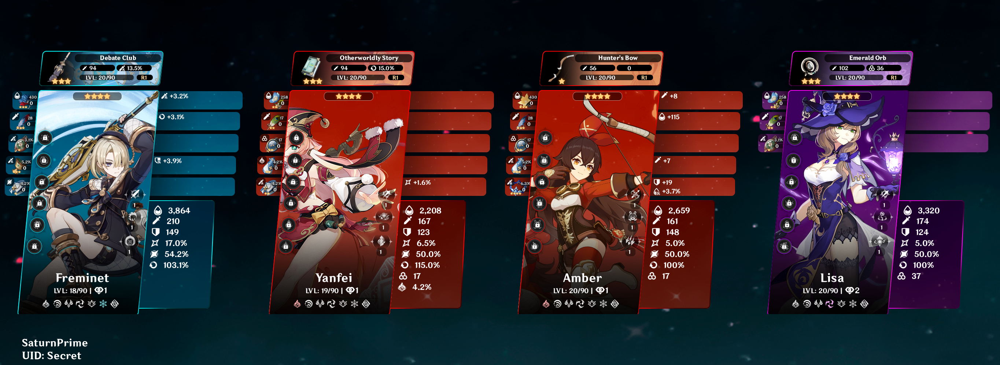
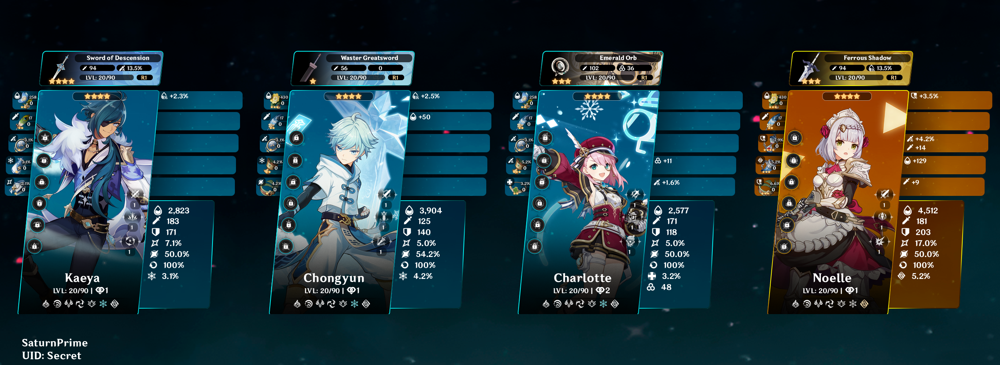

<h1 align="center">Anime Game Stats</h1>
<h3 align="center">🕒 Updated at <u>Sep 09, 2024 20:12 -0400</u></h3>
 

  

    
    Honkai Star Rail Details
  

  

    <h2>
       Daily Rewards
    </h2>
    <table>
      <tr>
        <td>Total Rewards Claimed</td>
        <td>10</td>
      </tr>
      <tr>
        <td>Last Claimed Reward</td>
        <td>
          3 x
          
          Adventure Log
        </td>
      </tr>
    </table>
  

  

    <h2>
      
      Stats
    </h2>
    <table>
      <tr>
        <td>Days Active</td>
        <td>253</td>
      </tr>
      <tr>
        <td>Total Avatar</td>
        <td>50</td>
      </tr>
      <tr>
        <td>Total Achievement</td>
        <td>495</td>
      </tr>
      <tr>
        <td>Chests Opened</td>
        <td>705</td>
      </tr>
    </table>
  

  

    <h2> Diary</h2>
    <table>
      <tr>
        <td>
           Stellar
          Jade earned
        </td>
        <td>3401 (rate -72)</td>
      </tr>
      <tr>
        <td>
          
          Pass & Special Pass earned
        </td>
        <td>15 (rate -62)</td>
      </tr>
      <tr>
        <td>Categories</td>
        <td>
          Adventure Rewards: 1425 (41%) Daily Activity: 1290 (37%) Simulated
          Universe: 465 (13%) Event: 200 (5%) Other: 1 (4%) Forgotten
          Hall: 0 (0%) Mail: 20 (0%) 
        </td>
      </tr>
    </table>
  

  

    <h2>Memory of Chaos</h2>
    <table>
      <tr>
        <td>Season</td>
        <td>1017</td>
      </tr>
      <tr>
        <td>Max Floor</td>
        <td>The Big Sleep (II)</td>
      </tr>
      <tr>
        <td>Total Battles</td>
        <td>2</td>
      </tr>
      <tr>
        <td>Total Stars</td>
        <td>2</td>
      </tr>
    </table>
  

  

    <h2>
      
      Characters
    </h2>
    

      
<b>Trailblazer </b>

       
      <table>
        <tr>
          <th><h3>Trailblazer</h3></th>
          <th><h3>Flowing Nightglow</h3></th>
        </tr>
        <tr>
          <td>
            

              
            

          </td>
          <td>
            

              
            

          </td>
        </tr>
        <tr>
          <td>
            <table>
              <tr>
                <td>Rarity</td>
                <td>★★★★★</td>
              </tr>
              <tr>
                <td>Element</td>
                <td>
                  
                </td>
              </tr>
              <tr>
                <td>Level</td>
                <td>80</td>
              </tr>
              <tr>
                <td>Eidolon</td>
                <td>3</td>
              </tr>
              <tr>
                <td>Relics</td>
                <td>
                  
                  Watchmaker's Telescoping Lens 
                  Watchmaker's Fortuitous Wristwatch 
                  Watchmaker's Illusory Formal Suit 
                  Watchmaker's Dream-Concealing Dress Shoes 
                </td>
              </tr>
              <tr>
                <td>Planar</td>
                <td>
                  
                  Talia's Nailscrap Town 
                  Talia's Exposed Electric Wire 
                </td>
              </tr>
            </table>
          </td>
          <td valign="top">
            <table>
              <tr>
                <td>Name</td>
                <td>Flowing Nightglow</td>
              </tr>
              <tr>
                <td>Level</td>
                <td>80</td>
              </tr>
              <tr>
                <td>Superimpose</td>
                <td>1</td>
              </tr>
            </table>
          </td>
        </tr>
      </table>
    

    

      
<b>Firefly </b>

       
      <table>
        <tr>
          <th><h3>Firefly</h3></th>
          <th><h3>Whereabouts Should Dreams Rest</h3></th>
        </tr>
        <tr>
          <td>
            

              
            

          </td>
          <td>
            

              
            

          </td>
        </tr>
        <tr>
          <td>
            <table>
              <tr>
                <td>Rarity</td>
                <td>★★★★★</td>
              </tr>
              <tr>
                <td>Element</td>
                <td>
                  
                </td>
              </tr>
              <tr>
                <td>Level</td>
                <td>80</td>
              </tr>
              <tr>
                <td>Eidolon</td>
                <td>0</td>
              </tr>
              <tr>
                <td>Relics</td>
                <td>
                  
                  Genius's Ultraremote Sensing Visor 
                  Grand Duke's Gloves of Fieryfur 
                  Champion's Chest Guard 
                  Watchmaker's Dream-Concealing Dress Shoes 
                </td>
              </tr>
              <tr>
                <td>Planar</td>
                <td>
                  
                  Talia's Nailscrap Town 
                  Talia's Exposed Electric Wire 
                </td>
              </tr>
            </table>
          </td>
          <td valign="top">
            <table>
              <tr>
                <td>Name</td>
                <td>Whereabouts Should Dreams Rest</td>
              </tr>
              <tr>
                <td>Level</td>
                <td>80</td>
              </tr>
              <tr>
                <td>Superimpose</td>
                <td>1</td>
              </tr>
            </table>
          </td>
        </tr>
      </table>
    

    

      
<b>Robin </b>

       
      <table>
        <tr>
          <th><h3>Robin</h3></th>
          <th><h3>Past and Future</h3></th>
        </tr>
        <tr>
          <td>
            

              
            

          </td>
          <td>
            

              
            

          </td>
        </tr>
        <tr>
          <td>
            <table>
              <tr>
                <td>Rarity</td>
                <td>★★★★★</td>
              </tr>
              <tr>
                <td>Element</td>
                <td>
                  
                </td>
              </tr>
              <tr>
                <td>Level</td>
                <td>80</td>
              </tr>
              <tr>
                <td>Eidolon</td>
                <td>0</td>
              </tr>
              <tr>
                <td>Relics</td>
                <td>
                  
                  Musketeer's Wild Wheat Felt Hat 
                  Musketeer's Coarse Leather Gloves 
                  Musketeer's Wind-Hunting Shawl 
                  Musketeer's Rivets Riding Boots 
                </td>
              </tr>
              <tr>
                <td>Planar</td>
                <td>
                  
                  The Xianzhou Luofu's Celestial Ark 
                  The Xianzhou Luofu's Ambrosial Arbor Vines 
                </td>
              </tr>
            </table>
          </td>
          <td valign="top">
            <table>
              <tr>
                <td>Name</td>
                <td>Past and Future</td>
              </tr>
              <tr>
                <td>Level</td>
                <td>70</td>
              </tr>
              <tr>
                <td>Superimpose</td>
                <td>1</td>
              </tr>
            </table>
          </td>
        </tr>
      </table>
    

    

      
<b>Acheron </b>

       
      <table>
        <tr>
          <th><h3>Acheron</h3></th>
          <th><h3>Along the Passing Shore</h3></th>
        </tr>
        <tr>
          <td>
            

              
            

          </td>
          <td>
            

              
            

          </td>
        </tr>
        <tr>
          <td>
            <table>
              <tr>
                <td>Rarity</td>
                <td>★★★★★</td>
              </tr>
              <tr>
                <td>Element</td>
                <td>
                  
                </td>
              </tr>
              <tr>
                <td>Level</td>
                <td>80</td>
              </tr>
              <tr>
                <td>Eidolon</td>
                <td>0</td>
              </tr>
              <tr>
                <td>Relics</td>
                <td>
                  
                  Pioneer's Heatproof Shell 
                  Pioneer's Lacuna Compass 
                  Pioneer's Sealed Lead Apron 
                  Pioneer's Starfaring Anchor 
                </td>
              </tr>
              <tr>
                <td>Planar</td>
                <td>
                  
                  Izumo's Magatsu no Morokami 
                  Izumo's Blades of Origin and End 
                </td>
              </tr>
            </table>
          </td>
          <td valign="top">
            <table>
              <tr>
                <td>Name</td>
                <td>Along the Passing Shore</td>
              </tr>
              <tr>
                <td>Level</td>
                <td>80</td>
              </tr>
              <tr>
                <td>Superimpose</td>
                <td>1</td>
              </tr>
            </table>
          </td>
        </tr>
      </table>
    

    

      
<b>Dr. Ratio </b>

       
      <table>
        <tr>
          <th><h3>Dr. Ratio</h3></th>
          <th><h3>Swordplay</h3></th>
        </tr>
        <tr>
          <td>
            

              
            

          </td>
          <td>
            

              
            

          </td>
        </tr>
        <tr>
          <td>
            <table>
              <tr>
                <td>Rarity</td>
                <td>★★★★★</td>
              </tr>
              <tr>
                <td>Element</td>
                <td>
                  
                </td>
              </tr>
              <tr>
                <td>Level</td>
                <td>80</td>
              </tr>
              <tr>
                <td>Eidolon</td>
                <td>0</td>
              </tr>
              <tr>
                <td>Relics</td>
                <td>
                  
                  Wastelander's Breathing Mask 
                  Wastelander's Desert Terminal 
                  Wastelander's Friar Robe 
                  Wastelander's Powered Greaves 
                </td>
              </tr>
              <tr>
                <td>Planar</td>
                <td>
                  
                  Glamoth's Iron Cavalry Regiment 
                  Glamoth's Silent Tombstone 
                </td>
              </tr>
            </table>
          </td>
          <td valign="top">
            <table>
              <tr>
                <td>Name</td>
                <td>Swordplay</td>
              </tr>
              <tr>
                <td>Level</td>
                <td>80</td>
              </tr>
              <tr>
                <td>Superimpose</td>
                <td>5</td>
              </tr>
            </table>
          </td>
        </tr>
      </table>
    

    

      
<b>Aventurine </b>

       
      <table>
        <tr>
          <th><h3>Aventurine</h3></th>
          <th><h3>Inherently Unjust Destiny</h3></th>
        </tr>
        <tr>
          <td>
            

              
            

          </td>
          <td>
            

              
            

          </td>
        </tr>
        <tr>
          <td>
            <table>
              <tr>
                <td>Rarity</td>
                <td>★★★★★</td>
              </tr>
              <tr>
                <td>Element</td>
                <td>
                  
                </td>
              </tr>
              <tr>
                <td>Level</td>
                <td>80</td>
              </tr>
              <tr>
                <td>Eidolon</td>
                <td>0</td>
              </tr>
              <tr>
                <td>Relics</td>
                <td>
                  
                  Knight's Forgiving Casque 
                  Knight's Silent Oath Ring 
                  Knight's Solemn Breastplate 
                  Knight's Iron Boots of Order 
                </td>
              </tr>
              <tr>
                <td>Planar</td>
                <td>
                  
                  Salsotto's Moving City 
                  Salsotto's Terminator Line 
                </td>
              </tr>
            </table>
          </td>
          <td valign="top">
            <table>
              <tr>
                <td>Name</td>
                <td>Inherently Unjust Destiny</td>
              </tr>
              <tr>
                <td>Level</td>
                <td>80</td>
              </tr>
              <tr>
                <td>Superimpose</td>
                <td>1</td>
              </tr>
            </table>
          </td>
        </tr>
      </table>
    

    

      
<b>Ruan Mei </b>

       
      <table>
        <tr>
          <th><h3>Ruan Mei</h3></th>
          <th><h3>Past Self in Mirror</h3></th>
        </tr>
        <tr>
          <td>
            

              
            

          </td>
          <td>
            

              
            

          </td>
        </tr>
        <tr>
          <td>
            <table>
              <tr>
                <td>Rarity</td>
                <td>★★★★★</td>
              </tr>
              <tr>
                <td>Element</td>
                <td>
                  
                </td>
              </tr>
              <tr>
                <td>Level</td>
                <td>80</td>
              </tr>
              <tr>
                <td>Eidolon</td>
                <td>0</td>
              </tr>
              <tr>
                <td>Relics</td>
                <td>
                  
                  Thief's Myriad-Faced Mask 
                  Thief's Gloves With Prints 
                  Thief's Steel Grappling Hook 
                  Thief's Meteor Boots 
                </td>
              </tr>
              <tr>
                <td>Planar</td>
                <td>
                  
                  Talia's Nailscrap Town 
                  Talia's Exposed Electric Wire 
                </td>
              </tr>
            </table>
          </td>
          <td valign="top">
            <table>
              <tr>
                <td>Name</td>
                <td>Past Self in Mirror</td>
              </tr>
              <tr>
                <td>Level</td>
                <td>70</td>
              </tr>
              <tr>
                <td>Superimpose</td>
                <td>1</td>
              </tr>
            </table>
          </td>
        </tr>
      </table>
    

    

      
<b>Bailu </b>

       
      <table>
        <tr>
          <th><h3>Bailu</h3></th>
          <th><h3>Time Waits for No One</h3></th>
        </tr>
        <tr>
          <td>
            

              
            

          </td>
          <td>
            

              
            

          </td>
        </tr>
        <tr>
          <td>
            <table>
              <tr>
                <td>Rarity</td>
                <td>★★★★★</td>
              </tr>
              <tr>
                <td>Element</td>
                <td>
                  
                </td>
              </tr>
              <tr>
                <td>Level</td>
                <td>80</td>
              </tr>
              <tr>
                <td>Eidolon</td>
                <td>1</td>
              </tr>
              <tr>
                <td>Relics</td>
                <td>
                  
                  Messenger's Holovisor 
                  Messenger's Transformative Arm 
                  Messenger's Secret Satchel 
                  Messenger's Par-kool Sneakers 
                </td>
              </tr>
              <tr>
                <td>Planar</td>
                <td>
                  
                  Insumousu's Whalefall Ship 
                  Insumousu's Frayed Hawser 
                </td>
              </tr>
            </table>
          </td>
          <td valign="top">
            <table>
              <tr>
                <td>Name</td>
                <td>Time Waits for No One</td>
              </tr>
              <tr>
                <td>Level</td>
                <td>80</td>
              </tr>
              <tr>
                <td>Superimpose</td>
                <td>1</td>
              </tr>
            </table>
          </td>
        </tr>
      </table>
    

    

      
<b>Yanqing </b>

       
      <table>
        <tr>
          <th><h3>Yanqing</h3></th>
          <th><h3>Swordplay</h3></th>
        </tr>
        <tr>
          <td>
            

              
            

          </td>
          <td>
            

              
            

          </td>
        </tr>
        <tr>
          <td>
            <table>
              <tr>
                <td>Rarity</td>
                <td>★★★★★</td>
              </tr>
              <tr>
                <td>Element</td>
                <td>
                  
                </td>
              </tr>
              <tr>
                <td>Level</td>
                <td>80</td>
              </tr>
              <tr>
                <td>Eidolon</td>
                <td>5</td>
              </tr>
              <tr>
                <td>Relics</td>
                <td>
                  
                  Hunter's Artaius Hood 
                  Hunter's Lizard Gloves 
                  Hunter's Ice Dragon Cloak 
                  Hunter's Soft Elkskin Boots 
                </td>
              </tr>
              <tr>
                <td>Planar</td>
                <td>
                  
                  Glamoth's Iron Cavalry Regiment 
                  Glamoth's Silent Tombstone 
                </td>
              </tr>
            </table>
          </td>
          <td valign="top">
            <table>
              <tr>
                <td>Name</td>
                <td>Swordplay</td>
              </tr>
              <tr>
                <td>Level</td>
                <td>60</td>
              </tr>
              <tr>
                <td>Superimpose</td>
                <td>5</td>
              </tr>
            </table>
          </td>
        </tr>
      </table>
    

    

      
<b>Luocha </b>

       
      <table>
        <tr>
          <th><h3>Luocha</h3></th>
          <th><h3>Echoes of the Coffin</h3></th>
        </tr>
        <tr>
          <td>
            

              
            

          </td>
          <td>
            

              
            

          </td>
        </tr>
        <tr>
          <td>
            <table>
              <tr>
                <td>Rarity</td>
                <td>★★★★★</td>
              </tr>
              <tr>
                <td>Element</td>
                <td>
                  
                </td>
              </tr>
              <tr>
                <td>Level</td>
                <td>80</td>
              </tr>
              <tr>
                <td>Eidolon</td>
                <td>0</td>
              </tr>
              <tr>
                <td>Relics</td>
                <td>
                  
                  Passerby's Rejuvenated Wooden Hairstick 
                  Passerby's Roaming Dragon Bracer 
                  Passerby's Ragged Embroided Coat 
                  Passerby's Stygian Hiking Boots 
                </td>
              </tr>
              <tr>
                <td>Planar</td>
                <td>
                  
                  Herta's Space Station 
                  Herta's Wandering Trek 
                </td>
              </tr>
            </table>
          </td>
          <td valign="top">
            <table>
              <tr>
                <td>Name</td>
                <td>Echoes of the Coffin</td>
              </tr>
              <tr>
                <td>Level</td>
                <td>80</td>
              </tr>
              <tr>
                <td>Superimpose</td>
                <td>1</td>
              </tr>
            </table>
          </td>
        </tr>
      </table>
    

    

      
<b>Topaz & Numby </b>

       
      <table>
        <tr>
          <th><h3>Topaz & Numby</h3></th>
          <th><h3>Worrisome, Blissful</h3></th>
        </tr>
        <tr>
          <td>
            

              
            

          </td>
          <td>
            

              
            

          </td>
        </tr>
        <tr>
          <td>
            <table>
              <tr>
                <td>Rarity</td>
                <td>★★★★★</td>
              </tr>
              <tr>
                <td>Element</td>
                <td>
                  
                </td>
              </tr>
              <tr>
                <td>Level</td>
                <td>80</td>
              </tr>
              <tr>
                <td>Eidolon</td>
                <td>0</td>
              </tr>
              <tr>
                <td>Relics</td>
                <td>
                  
                  Grand Duke's Crown of Netherflame 
                  Grand Duke's Gloves of Fieryfur 
                  Grand Duke's Robe of Grace 
                  Grand Duke's Ceremonial Boots 
                </td>
              </tr>
              <tr>
                <td>Planar</td>
                <td>
                  
                  Salsotto's Moving City 
                  Salsotto's Terminator Line 
                </td>
              </tr>
            </table>
          </td>
          <td valign="top">
            <table>
              <tr>
                <td>Name</td>
                <td>Worrisome, Blissful</td>
              </tr>
              <tr>
                <td>Level</td>
                <td>70</td>
              </tr>
              <tr>
                <td>Superimpose</td>
                <td>1</td>
              </tr>
            </table>
          </td>
        </tr>
      </table>
    

    

      
<b>Kafka </b>

       
      <table>
        <tr>
          <th><h3>Kafka</h3></th>
          <th><h3>Solitary Healing</h3></th>
        </tr>
        <tr>
          <td>
            

              
            

          </td>
          <td>
            

              
            

          </td>
        </tr>
        <tr>
          <td>
            <table>
              <tr>
                <td>Rarity</td>
                <td>★★★★★</td>
              </tr>
              <tr>
                <td>Element</td>
                <td>
                  
                </td>
              </tr>
              <tr>
                <td>Level</td>
                <td>80</td>
              </tr>
              <tr>
                <td>Eidolon</td>
                <td>1</td>
              </tr>
              <tr>
                <td>Relics</td>
                <td>
                  
                  Band's Polarized Sunglasses 
                  Band's Touring Bracelet 
                  Band's Leather Jacket With Studs 
                  Band's Ankle Boots With Rivets 
                </td>
              </tr>
              <tr>
                <td>Planar</td>
                <td>
                  
                  Glamoth's Iron Cavalry Regiment 
                  Glamoth's Silent Tombstone 
                </td>
              </tr>
            </table>
          </td>
          <td valign="top">
            <table>
              <tr>
                <td>Name</td>
                <td>Solitary Healing</td>
              </tr>
              <tr>
                <td>Level</td>
                <td>80</td>
              </tr>
              <tr>
                <td>Superimpose</td>
                <td>1</td>
              </tr>
            </table>
          </td>
        </tr>
      </table>
    

    

      
<b>Pela </b>

       
      <table>
        <tr>
          <th><h3>Pela</h3></th>
          <th><h3>We Will Meet Again</h3></th>
        </tr>
        <tr>
          <td>
            

              
            

          </td>
          <td>
            

              
            

          </td>
        </tr>
        <tr>
          <td>
            <table>
              <tr>
                <td>Rarity</td>
                <td>★★★★</td>
              </tr>
              <tr>
                <td>Element</td>
                <td>
                  
                </td>
              </tr>
              <tr>
                <td>Level</td>
                <td>80</td>
              </tr>
              <tr>
                <td>Eidolon</td>
                <td>6</td>
              </tr>
              <tr>
                <td>Relics</td>
                <td>
                  
                  Hunter's Artaius Hood 
                  Hunter's Lizard Gloves 
                  Hunter's Ice Dragon Cloak 
                  Hunter's Soft Elkskin Boots 
                </td>
              </tr>
              <tr>
                <td>Planar</td>
                <td>
                  
                  Penacony's Grand Hotel 
                  Penacony's Dream-Seeking Tracks 
                </td>
              </tr>
            </table>
          </td>
          <td valign="top">
            <table>
              <tr>
                <td>Name</td>
                <td>We Will Meet Again</td>
              </tr>
              <tr>
                <td>Level</td>
                <td>60</td>
              </tr>
              <tr>
                <td>Superimpose</td>
                <td>1</td>
              </tr>
            </table>
          </td>
        </tr>
      </table>
    

    

      
<b>Natasha </b>

       
      <table>
        <tr>
          <th><h3>Natasha</h3></th>
          <th><h3>Post-Op Conversation</h3></th>
        </tr>
        <tr>
          <td>
            

              
            

          </td>
          <td>
            

              
            

          </td>
        </tr>
        <tr>
          <td>
            <table>
              <tr>
                <td>Rarity</td>
                <td>★★★★</td>
              </tr>
              <tr>
                <td>Element</td>
                <td>
                  
                </td>
              </tr>
              <tr>
                <td>Level</td>
                <td>80</td>
              </tr>
              <tr>
                <td>Eidolon</td>
                <td>5</td>
              </tr>
              <tr>
                <td>Relics</td>
                <td>
                  
                  Messenger's Holovisor 
                  Messenger's Transformative Arm 
                  Messenger's Secret Satchel 
                  Messenger's Par-kool Sneakers 
                </td>
              </tr>
              <tr>
                <td>Planar</td>
                <td>
                  
                  The Xianzhou Luofu's Celestial Ark 
                  The Xianzhou Luofu's Ambrosial Arbor Vines 
                </td>
              </tr>
            </table>
          </td>
          <td valign="top">
            <table>
              <tr>
                <td>Name</td>
                <td>Post-Op Conversation</td>
              </tr>
              <tr>
                <td>Level</td>
                <td>50</td>
              </tr>
              <tr>
                <td>Superimpose</td>
                <td>3</td>
              </tr>
            </table>
          </td>
        </tr>
      </table>
    

    

      
<b>Dan Heng </b>

       
      <table>
        <tr>
          <th><h3>Dan Heng</h3></th>
          <th><h3>River Flows in Spring</h3></th>
        </tr>
        <tr>
          <td>
            

              
            

          </td>
          <td>
            

              
            

          </td>
        </tr>
        <tr>
          <td>
            <table>
              <tr>
                <td>Rarity</td>
                <td>★★★★</td>
              </tr>
              <tr>
                <td>Element</td>
                <td>
                  
                </td>
              </tr>
              <tr>
                <td>Level</td>
                <td>80</td>
              </tr>
              <tr>
                <td>Eidolon</td>
                <td>6</td>
              </tr>
              <tr>
                <td>Relics</td>
                <td>
                  
                  Eagle's Beaked Helmet 
                  Eagle's Soaring Ring 
                  Eagle's Winged Suit Harness 
                  Eagle's Quilted Puttees 
                </td>
              </tr>
              <tr>
                <td>Planar</td>
                <td>
                  
                  Glamoth's Iron Cavalry Regiment 
                  Glamoth's Silent Tombstone 
                </td>
              </tr>
            </table>
          </td>
          <td valign="top">
            <table>
              <tr>
                <td>Name</td>
                <td>River Flows in Spring</td>
              </tr>
              <tr>
                <td>Level</td>
                <td>70</td>
              </tr>
              <tr>
                <td>Superimpose</td>
                <td>1</td>
              </tr>
            </table>
          </td>
        </tr>
      </table>
    

    

      
<b>March 7th </b>

       
      <table>
        <tr>
          <th><h3>March 7th</h3></th>
          <th><h3>Texture of Memories</h3></th>
        </tr>
        <tr>
          <td>
            

              
            

          </td>
          <td>
            

              
            

          </td>
        </tr>
        <tr>
          <td>
            <table>
              <tr>
                <td>Rarity</td>
                <td>★★★★</td>
              </tr>
              <tr>
                <td>Element</td>
                <td>
                  
                </td>
              </tr>
              <tr>
                <td>Level</td>
                <td>80</td>
              </tr>
              <tr>
                <td>Eidolon</td>
                <td>6</td>
              </tr>
              <tr>
                <td>Relics</td>
                <td>
                  
                  Guard's Cast Iron Helmet 
                  Guard's Shining Gauntlets 
                  Guard's Uniform of Old 
                  Guard's Silver Greaves 
                </td>
              </tr>
              <tr>
                <td>Planar</td>
                <td>
                  
                  Belobog's Fortress of Preservation 
                  Belobog's Iron Defense 
                </td>
              </tr>
            </table>
          </td>
          <td valign="top">
            <table>
              <tr>
                <td>Name</td>
                <td>Texture of Memories</td>
              </tr>
              <tr>
                <td>Level</td>
                <td>80</td>
              </tr>
              <tr>
                <td>Superimpose</td>
                <td>1</td>
              </tr>
            </table>
          </td>
        </tr>
      </table>
    

    

      
<b>Yukong </b>

       
      <table>
        <tr>
          <th><h3>Yukong</h3></th>
          <th><h3>Dance! Dance! Dance!</h3></th>
        </tr>
        <tr>
          <td>
            

              
            

          </td>
          <td>
            

              
            

          </td>
        </tr>
        <tr>
          <td>
            <table>
              <tr>
                <td>Rarity</td>
                <td>★★★★</td>
              </tr>
              <tr>
                <td>Element</td>
                <td>
                  
                </td>
              </tr>
              <tr>
                <td>Level</td>
                <td>78</td>
              </tr>
              <tr>
                <td>Eidolon</td>
                <td>6</td>
              </tr>
              <tr>
                <td>Relics</td>
                <td>
                  
                  Musketeer's Wild Wheat Felt Hat 
                  Musketeer's Coarse Leather Gloves 
                  Musketeer's Wind-Hunting Shawl 
                  Musketeer's Rivets Riding Boots 
                </td>
              </tr>
              <tr>
                <td>Planar</td>
                <td>
                  
                  The Xianzhou Luofu's Celestial Ark 
                  The Xianzhou Luofu's Ambrosial Arbor Vines 
                </td>
              </tr>
            </table>
          </td>
          <td valign="top">
            <table>
              <tr>
                <td>Name</td>
                <td>Dance! Dance! Dance!</td>
              </tr>
              <tr>
                <td>Level</td>
                <td>40</td>
              </tr>
              <tr>
                <td>Superimpose</td>
                <td>5</td>
              </tr>
            </table>
          </td>
        </tr>
      </table>
    

    

      
<b>Lynx </b>

       
      <table>
        <tr>
          <th><h3>Lynx</h3></th>
          <th><h3>Post-Op Conversation</h3></th>
        </tr>
        <tr>
          <td>
            

              
            

          </td>
          <td>
            

              
            

          </td>
        </tr>
        <tr>
          <td>
            <table>
              <tr>
                <td>Rarity</td>
                <td>★★★★</td>
              </tr>
              <tr>
                <td>Element</td>
                <td>
                  
                </td>
              </tr>
              <tr>
                <td>Level</td>
                <td>77</td>
              </tr>
              <tr>
                <td>Eidolon</td>
                <td>6</td>
              </tr>
              <tr>
                <td>Relics</td>
                <td>
                  
                  Messenger's Holovisor 
                  Messenger's Transformative Arm 
                  Messenger's Secret Satchel 
                  Messenger's Par-kool Sneakers 
                </td>
              </tr>
              <tr>
                <td>Planar</td>
                <td>
                  
                  The Xianzhou Luofu's Celestial Ark 
                  The Xianzhou Luofu's Ambrosial Arbor Vines 
                </td>
              </tr>
            </table>
          </td>
          <td valign="top">
            <table>
              <tr>
                <td>Name</td>
                <td>Post-Op Conversation</td>
              </tr>
              <tr>
                <td>Level</td>
                <td>70</td>
              </tr>
              <tr>
                <td>Superimpose</td>
                <td>2</td>
              </tr>
            </table>
          </td>
        </tr>
      </table>
    

    

      
<b>Serval </b>

       
      <table>
        <tr>
          <th><h3>Serval</h3></th>
          <th><h3>The Seriousness of Breakfast</h3></th>
        </tr>
        <tr>
          <td>
            

              
            

          </td>
          <td>
            

              
            

          </td>
        </tr>
        <tr>
          <td>
            <table>
              <tr>
                <td>Rarity</td>
                <td>★★★★</td>
              </tr>
              <tr>
                <td>Element</td>
                <td>
                  
                </td>
              </tr>
              <tr>
                <td>Level</td>
                <td>77</td>
              </tr>
              <tr>
                <td>Eidolon</td>
                <td>6</td>
              </tr>
              <tr>
                <td>Relics</td>
                <td>
                  
                  Thief's Myriad-Faced Mask 
                  Thief's Gloves With Prints 
                  Thief's Steel Grappling Hook 
                  Thief's Meteor Boots 
                </td>
              </tr>
              <tr>
                <td>Planar</td>
                <td>
                  
                  Herta's Space Station 
                  Herta's Wandering Trek 
                </td>
              </tr>
            </table>
          </td>
          <td valign="top">
            <table>
              <tr>
                <td>Name</td>
                <td>The Seriousness of Breakfast</td>
              </tr>
              <tr>
                <td>Level</td>
                <td>30</td>
              </tr>
              <tr>
                <td>Superimpose</td>
                <td>3</td>
              </tr>
            </table>
          </td>
        </tr>
      </table>
    

    

      
<b>Jingliu </b>

       
      <table>
        <tr>
          <th><h3>Jingliu</h3></th>
          <th><h3>Nowhere to Run</h3></th>
        </tr>
        <tr>
          <td>
            

              
            

          </td>
          <td>
            

              
            

          </td>
        </tr>
        <tr>
          <td>
            <table>
              <tr>
                <td>Rarity</td>
                <td>★★★★★</td>
              </tr>
              <tr>
                <td>Element</td>
                <td>
                  
                </td>
              </tr>
              <tr>
                <td>Level</td>
                <td>76</td>
              </tr>
              <tr>
                <td>Eidolon</td>
                <td>0</td>
              </tr>
              <tr>
                <td>Relics</td>
                <td>
                  
                  Hunter's Artaius Hood 
                  Hunter's Lizard Gloves 
                  Hunter's Ice Dragon Cloak 
                  Hunter's Soft Elkskin Boots 
                </td>
              </tr>
              <tr>
                <td>Planar</td>
                <td>
                  
                  Taikiyan Laser Stadium 
                  Taikiyan's Arclight Race Track 
                </td>
              </tr>
            </table>
          </td>
          <td valign="top">
            <table>
              <tr>
                <td>Name</td>
                <td>Nowhere to Run</td>
              </tr>
              <tr>
                <td>Level</td>
                <td>50</td>
              </tr>
              <tr>
                <td>Superimpose</td>
                <td>1</td>
              </tr>
            </table>
          </td>
        </tr>
      </table>
    

    

      
<b>Jing Yuan </b>

       
      <table>
        <tr>
          <th><h3>Jing Yuan</h3></th>
          <th><h3>Geniuses' Repose</h3></th>
        </tr>
        <tr>
          <td>
            

              
            

          </td>
          <td>
            

              
            

          </td>
        </tr>
        <tr>
          <td>
            <table>
              <tr>
                <td>Rarity</td>
                <td>★★★★★</td>
              </tr>
              <tr>
                <td>Element</td>
                <td>
                  
                </td>
              </tr>
              <tr>
                <td>Level</td>
                <td>76</td>
              </tr>
              <tr>
                <td>Eidolon</td>
                <td>1</td>
              </tr>
              <tr>
                <td>Relics</td>
                <td>
                  
                  Grand Duke's Crown of Netherflame 
                  Grand Duke's Gloves of Fieryfur 
                  Grand Duke's Robe of Grace 
                  Grand Duke's Ceremonial Boots 
                </td>
              </tr>
              <tr>
                <td>Planar</td>
                <td>
                  
                  Salsotto's Moving City 
                  Salsotto's Terminator Line 
                </td>
              </tr>
            </table>
          </td>
          <td valign="top">
            <table>
              <tr>
                <td>Name</td>
                <td>Geniuses' Repose</td>
              </tr>
              <tr>
                <td>Level</td>
                <td>70</td>
              </tr>
              <tr>
                <td>Superimpose</td>
                <td>5</td>
              </tr>
            </table>
          </td>
        </tr>
      </table>
    

    

      
<b>Sushang </b>

       
      <table>
        <tr>
          <th><h3>Sushang</h3></th>
          <th><h3>Subscribe for More!</h3></th>
        </tr>
        <tr>
          <td>
            

              
            

          </td>
          <td>
            

              
            

          </td>
        </tr>
        <tr>
          <td>
            <table>
              <tr>
                <td>Rarity</td>
                <td>★★★★</td>
              </tr>
              <tr>
                <td>Element</td>
                <td>
                  
                </td>
              </tr>
              <tr>
                <td>Level</td>
                <td>76</td>
              </tr>
              <tr>
                <td>Eidolon</td>
                <td>6</td>
              </tr>
              <tr>
                <td>Relics</td>
                <td>
                  
                  Thief's Myriad-Faced Mask 
                  Thief's Gloves With Prints 
                  Thief's Steel Grappling Hook 
                  Thief's Meteor Boots 
                </td>
              </tr>
              <tr>
                <td>Planar</td>
                <td>
                  
                  Glamoth's Iron Cavalry Regiment 
                  Glamoth's Silent Tombstone 
                </td>
              </tr>
            </table>
          </td>
          <td valign="top">
            <table>
              <tr>
                <td>Name</td>
                <td>Subscribe for More!</td>
              </tr>
              <tr>
                <td>Level</td>
                <td>30</td>
              </tr>
              <tr>
                <td>Superimpose</td>
                <td>5</td>
              </tr>
            </table>
          </td>
        </tr>
      </table>
    

    

      
<b>Fu Xuan </b>

       
      <table>
        <tr>
          <th><h3>Fu Xuan</h3></th>
          <th><h3>She Already Shut Her Eyes</h3></th>
        </tr>
        <tr>
          <td>
            

              
            

          </td>
          <td>
            

              
            

          </td>
        </tr>
        <tr>
          <td>
            <table>
              <tr>
                <td>Rarity</td>
                <td>★★★★★</td>
              </tr>
              <tr>
                <td>Element</td>
                <td>
                  
                </td>
              </tr>
              <tr>
                <td>Level</td>
                <td>75</td>
              </tr>
              <tr>
                <td>Eidolon</td>
                <td>0</td>
              </tr>
              <tr>
                <td>Relics</td>
                <td>
                  
                  Watchmaker's Telescoping Lens 
                  Watchmaker's Fortuitous Wristwatch 
                  Watchmaker's Illusory Formal Suit 
                  Watchmaker's Dream-Concealing Dress Shoes 
                </td>
              </tr>
              <tr>
                <td>Planar</td>
                <td>
                  
                  The Xianzhou Luofu's Celestial Ark 
                  The Xianzhou Luofu's Ambrosial Arbor Vines 
                </td>
              </tr>
            </table>
          </td>
          <td valign="top">
            <table>
              <tr>
                <td>Name</td>
                <td>She Already Shut Her Eyes</td>
              </tr>
              <tr>
                <td>Level</td>
                <td>53</td>
              </tr>
              <tr>
                <td>Superimpose</td>
                <td>1</td>
              </tr>
            </table>
          </td>
        </tr>
      </table>
    

    

      
<b>Misha </b>

       
      <table>
        <tr>
          <th><h3>Misha</h3></th>
          <th><h3>Woof! Walk Time!</h3></th>
        </tr>
        <tr>
          <td>
            

              
            

          </td>
          <td>
            

              
            

          </td>
        </tr>
        <tr>
          <td>
            <table>
              <tr>
                <td>Rarity</td>
                <td>★★★★</td>
              </tr>
              <tr>
                <td>Element</td>
                <td>
                  
                </td>
              </tr>
              <tr>
                <td>Level</td>
                <td>75</td>
              </tr>
              <tr>
                <td>Eidolon</td>
                <td>6</td>
              </tr>
              <tr>
                <td>Relics</td>
                <td>
                  
                  Hunter's Artaius Hood 
                  Hunter's Lizard Gloves 
                  Hunter's Ice Dragon Cloak 
                  Hunter's Soft Elkskin Boots 
                </td>
              </tr>
              <tr>
                <td>Planar</td>
                <td>
                  
                  Salsotto's Moving City 
                  Salsotto's Terminator Line 
                </td>
              </tr>
            </table>
          </td>
          <td valign="top">
            <table>
              <tr>
                <td>Name</td>
                <td>Woof! Walk Time!</td>
              </tr>
              <tr>
                <td>Level</td>
                <td>40</td>
              </tr>
              <tr>
                <td>Superimpose</td>
                <td>1</td>
              </tr>
            </table>
          </td>
        </tr>
      </table>
    

    

      
<b>Arlan </b>

       
      <table>
        <tr>
          <th><h3>Arlan</h3></th>
          <th><h3>Something Irreplaceable</h3></th>
        </tr>
        <tr>
          <td>
            

              
            

          </td>
          <td>
            

              
            

          </td>
        </tr>
        <tr>
          <td>
            <table>
              <tr>
                <td>Rarity</td>
                <td>★★★★</td>
              </tr>
              <tr>
                <td>Element</td>
                <td>
                  
                </td>
              </tr>
              <tr>
                <td>Level</td>
                <td>75</td>
              </tr>
              <tr>
                <td>Eidolon</td>
                <td>6</td>
              </tr>
              <tr>
                <td>Relics</td>
                <td>
                  
                  Thief's Myriad-Faced Mask 
                  Thief's Gloves With Prints 
                  Thief's Steel Grappling Hook 
                  Thief's Meteor Boots 
                </td>
              </tr>
              <tr>
                <td>Planar</td>
                <td>
                  
                  Herta's Space Station 
                  Herta's Wandering Trek 
                </td>
              </tr>
            </table>
          </td>
          <td valign="top">
            <table>
              <tr>
                <td>Name</td>
                <td>Something Irreplaceable</td>
              </tr>
              <tr>
                <td>Level</td>
                <td>30</td>
              </tr>
              <tr>
                <td>Superimpose</td>
                <td>3</td>
              </tr>
            </table>
          </td>
        </tr>
      </table>
    

    

      
<b>Gallagher </b>

       
      <table>
        <tr>
          <th><h3>Gallagher</h3></th>
          <th><h3>Quid Pro Quo</h3></th>
        </tr>
        <tr>
          <td>
            

              
            

          </td>
          <td>
            

              
            

          </td>
        </tr>
        <tr>
          <td>
            <table>
              <tr>
                <td>Rarity</td>
                <td>★★★★</td>
              </tr>
              <tr>
                <td>Element</td>
                <td>
                  
                </td>
              </tr>
              <tr>
                <td>Level</td>
                <td>74</td>
              </tr>
              <tr>
                <td>Eidolon</td>
                <td>6</td>
              </tr>
              <tr>
                <td>Relics</td>
                <td>
                  
                  Thief's Myriad-Faced Mask 
                  Thief's Gloves With Prints 
                  Thief's Steel Grappling Hook 
                  Thief's Meteor Boots 
                </td>
              </tr>
              <tr>
                <td>Planar</td>
                <td>
                  
                  The Xianzhou Luofu's Celestial Ark 
                  The Xianzhou Luofu's Ambrosial Arbor Vines 
                </td>
              </tr>
            </table>
          </td>
          <td valign="top">
            <table>
              <tr>
                <td>Name</td>
                <td>Quid Pro Quo</td>
              </tr>
              <tr>
                <td>Level</td>
                <td>50</td>
              </tr>
              <tr>
                <td>Superimpose</td>
                <td>1</td>
              </tr>
            </table>
          </td>
        </tr>
      </table>
    

    

      
<b>Luka </b>

       
      <table>
        <tr>
          <th><h3>Luka</h3></th>
          <th><h3>Good Night and Sleep Well</h3></th>
        </tr>
        <tr>
          <td>
            

              
            

          </td>
          <td>
            

              
            

          </td>
        </tr>
        <tr>
          <td>
            <table>
              <tr>
                <td>Rarity</td>
                <td>★★★★</td>
              </tr>
              <tr>
                <td>Element</td>
                <td>
                  
                </td>
              </tr>
              <tr>
                <td>Level</td>
                <td>74</td>
              </tr>
              <tr>
                <td>Eidolon</td>
                <td>6</td>
              </tr>
              <tr>
                <td>Relics</td>
                <td>
                  
                  Champion's Headgear 
                  Champion's Heavy Gloves 
                  Champion's Chest Guard 
                  Champion's Fleetfoot Boots 
                </td>
              </tr>
              <tr>
                <td>Planar</td>
                <td>
                  
                  Herta's Space Station 
                  Herta's Wandering Trek 
                </td>
              </tr>
            </table>
          </td>
          <td valign="top">
            <table>
              <tr>
                <td>Name</td>
                <td>Good Night and Sleep Well</td>
              </tr>
              <tr>
                <td>Level</td>
                <td>80</td>
              </tr>
              <tr>
                <td>Superimpose</td>
                <td>5</td>
              </tr>
            </table>
          </td>
        </tr>
      </table>
    

    

      
<b>Dan Heng • Imbibitor Lunae </b>

       
      <table>
        <tr>
          <th><h3>Dan Heng • Imbibitor Lunae</h3></th>
          <th><h3>Woof! Walk Time!</h3></th>
        </tr>
        <tr>
          <td>
            

              
            

          </td>
          <td>
            

              
            

          </td>
        </tr>
        <tr>
          <td>
            <table>
              <tr>
                <td>Rarity</td>
                <td>★★★★★</td>
              </tr>
              <tr>
                <td>Element</td>
                <td>
                  
                </td>
              </tr>
              <tr>
                <td>Level</td>
                <td>73</td>
              </tr>
              <tr>
                <td>Eidolon</td>
                <td>0</td>
              </tr>
              <tr>
                <td>Relics</td>
                <td>
                  
                  Musketeer's Wild Wheat Felt Hat 
                  Musketeer's Coarse Leather Gloves 
                  Musketeer's Wind-Hunting Shawl 
                  Musketeer's Rivets Riding Boots 
                </td>
              </tr>
              <tr>
                <td>Planar</td>
                <td>
                  
                  Planet Screwllum's Mechanical Sun 
                  Planet Screwllum's Ring System 
                </td>
              </tr>
            </table>
          </td>
          <td valign="top">
            <table>
              <tr>
                <td>Name</td>
                <td>Woof! Walk Time!</td>
              </tr>
              <tr>
                <td>Level</td>
                <td>40</td>
              </tr>
              <tr>
                <td>Superimpose</td>
                <td>1</td>
              </tr>
            </table>
          </td>
        </tr>
      </table>
    

    

      
<b>Guinaifen </b>

       
      <table>
        <tr>
          <th><h3>Guinaifen</h3></th>
          <th><h3>Eyes of the Prey</h3></th>
        </tr>
        <tr>
          <td>
            

              
            

          </td>
          <td>
            

              
            

          </td>
        </tr>
        <tr>
          <td>
            <table>
              <tr>
                <td>Rarity</td>
                <td>★★★★</td>
              </tr>
              <tr>
                <td>Element</td>
                <td>
                  
                </td>
              </tr>
              <tr>
                <td>Level</td>
                <td>73</td>
              </tr>
              <tr>
                <td>Eidolon</td>
                <td>6</td>
              </tr>
              <tr>
                <td>Relics</td>
                <td>
                  
                  Thief's Myriad-Faced Mask 
                  Thief's Gloves With Prints 
                  Thief's Steel Grappling Hook 
                  Thief's Meteor Boots 
                </td>
              </tr>
              <tr>
                <td>Planar</td>
                <td>
                  
                  Herta's Space Station 
                  Herta's Wandering Trek 
                </td>
              </tr>
            </table>
          </td>
          <td valign="top">
            <table>
              <tr>
                <td>Name</td>
                <td>Eyes of the Prey</td>
              </tr>
              <tr>
                <td>Level</td>
                <td>30</td>
              </tr>
              <tr>
                <td>Superimpose</td>
                <td>1</td>
              </tr>
            </table>
          </td>
        </tr>
      </table>
    

    

      
<b>Qingque </b>

       
      <table>
        <tr>
          <th><h3>Qingque</h3></th>
          <th><h3>The Birth of the Self</h3></th>
        </tr>
        <tr>
          <td>
            

              
            

          </td>
          <td>
            

              
            

          </td>
        </tr>
        <tr>
          <td>
            <table>
              <tr>
                <td>Rarity</td>
                <td>★★★★</td>
              </tr>
              <tr>
                <td>Element</td>
                <td>
                  
                </td>
              </tr>
              <tr>
                <td>Level</td>
                <td>73</td>
              </tr>
              <tr>
                <td>Eidolon</td>
                <td>6</td>
              </tr>
              <tr>
                <td>Relics</td>
                <td>
                  
                  Musketeer's Wild Wheat Felt Hat 
                  Musketeer's Coarse Leather Gloves 
                  Musketeer's Wind-Hunting Shawl 
                  Musketeer's Rivets Riding Boots 
                </td>
              </tr>
              <tr>
                <td>Planar</td>
                <td>
                  
                  Planet Screwllum's Mechanical Sun 
                  Planet Screwllum's Ring System 
                </td>
              </tr>
            </table>
          </td>
          <td valign="top">
            <table>
              <tr>
                <td>Name</td>
                <td>The Birth of the Self</td>
              </tr>
              <tr>
                <td>Level</td>
                <td>30</td>
              </tr>
              <tr>
                <td>Superimpose</td>
                <td>5</td>
              </tr>
            </table>
          </td>
        </tr>
      </table>
    

    

      
<b>Hook </b>

       
      <table>
        <tr>
          <th><h3>Hook</h3></th>
          <th><h3>The Moles Welcome You</h3></th>
        </tr>
        <tr>
          <td>
            

              
            

          </td>
          <td>
            

              
            

          </td>
        </tr>
        <tr>
          <td>
            <table>
              <tr>
                <td>Rarity</td>
                <td>★★★★</td>
              </tr>
              <tr>
                <td>Element</td>
                <td>
                  
                </td>
              </tr>
              <tr>
                <td>Level</td>
                <td>73</td>
              </tr>
              <tr>
                <td>Eidolon</td>
                <td>6</td>
              </tr>
              <tr>
                <td>Relics</td>
                <td>
                  
                  Firesmith's Obsidian Goggles 
                  Firesmith's Ring of Flame-Mastery 
                  Firesmith's Fireproof Apron 
                  Firesmith's Alloy Leg 
                </td>
              </tr>
              <tr>
                <td>Planar</td>
                <td>
                  
                  Herta's Space Station 
                  Herta's Wandering Trek 
                </td>
              </tr>
            </table>
          </td>
          <td valign="top">
            <table>
              <tr>
                <td>Name</td>
                <td>The Moles Welcome You</td>
              </tr>
              <tr>
                <td>Level</td>
                <td>40</td>
              </tr>
              <tr>
                <td>Superimpose</td>
                <td>5</td>
              </tr>
            </table>
          </td>
        </tr>
      </table>
    

    

      
<b>Blade </b>

       
      <table>
        <tr>
          <th><h3>Blade</h3></th>
          <th><h3>Nowhere to Run</h3></th>
        </tr>
        <tr>
          <td>
            

              
            

          </td>
          <td>
            

              
            

          </td>
        </tr>
        <tr>
          <td>
            <table>
              <tr>
                <td>Rarity</td>
                <td>★★★★★</td>
              </tr>
              <tr>
                <td>Element</td>
                <td>
                  
                </td>
              </tr>
              <tr>
                <td>Level</td>
                <td>72</td>
              </tr>
              <tr>
                <td>Eidolon</td>
                <td>0</td>
              </tr>
              <tr>
                <td>Relics</td>
                <td>
                  
                  Disciple's Prosthetic Eye 
                  Disciple's Ingenium Hand 
                  Disciple's Dewy Feather Garb 
                  Disciple's Celestial Silk Sandals 
                </td>
              </tr>
              <tr>
                <td>Planar</td>
                <td>
                  
                  Salsotto's Moving City 
                  Salsotto's Terminator Line 
                </td>
              </tr>
            </table>
          </td>
          <td valign="top">
            <table>
              <tr>
                <td>Name</td>
                <td>Nowhere to Run</td>
              </tr>
              <tr>
                <td>Level</td>
                <td>40</td>
              </tr>
              <tr>
                <td>Superimpose</td>
                <td>1</td>
              </tr>
            </table>
          </td>
        </tr>
      </table>
    

    

      
<b>Xueyi </b>

       
      <table>
        <tr>
          <th><h3>Xueyi</h3></th>
          <th><h3>A Secret Vow</h3></th>
        </tr>
        <tr>
          <td>
            

              
            

          </td>
          <td>
            

              
            

          </td>
        </tr>
        <tr>
          <td>
            <table>
              <tr>
                <td>Rarity</td>
                <td>★★★★</td>
              </tr>
              <tr>
                <td>Element</td>
                <td>
                  
                </td>
              </tr>
              <tr>
                <td>Level</td>
                <td>72</td>
              </tr>
              <tr>
                <td>Eidolon</td>
                <td>6</td>
              </tr>
              <tr>
                <td>Relics</td>
                <td>
                  
                  Thief's Myriad-Faced Mask 
                  Thief's Gloves With Prints 
                  Thief's Steel Grappling Hook 
                  Thief's Meteor Boots 
                </td>
              </tr>
              <tr>
                <td>Planar</td>
                <td>
                  
                  Talia's Nailscrap Town 
                  Talia's Exposed Electric Wire 
                </td>
              </tr>
            </table>
          </td>
          <td valign="top">
            <table>
              <tr>
                <td>Name</td>
                <td>A Secret Vow</td>
              </tr>
              <tr>
                <td>Level</td>
                <td>40</td>
              </tr>
              <tr>
                <td>Superimpose</td>
                <td>5</td>
              </tr>
            </table>
          </td>
        </tr>
      </table>
    

    

      
<b>Herta </b>

       
      <table>
        <tr>
          <th><h3>Herta</h3></th>
          <th><h3>Make the World Clamor</h3></th>
        </tr>
        <tr>
          <td>
            

              
            

          </td>
          <td>
            

              
            

          </td>
        </tr>
        <tr>
          <td>
            <table>
              <tr>
                <td>Rarity</td>
                <td>★★★★</td>
              </tr>
              <tr>
                <td>Element</td>
                <td>
                  
                </td>
              </tr>
              <tr>
                <td>Level</td>
                <td>72</td>
              </tr>
              <tr>
                <td>Eidolon</td>
                <td>6</td>
              </tr>
              <tr>
                <td>Relics</td>
                <td>
                  
                  Hunter's Artaius Hood 
                  Hunter's Lizard Gloves 
                  Hunter's Ice Dragon Cloak 
                  Hunter's Soft Elkskin Boots 
                </td>
              </tr>
              <tr>
                <td>Planar</td>
                <td>
                  
                  Salsotto's Moving City 
                  Salsotto's Terminator Line 
                </td>
              </tr>
            </table>
          </td>
          <td valign="top">
            <table>
              <tr>
                <td>Name</td>
                <td>Make the World Clamor</td>
              </tr>
              <tr>
                <td>Level</td>
                <td>50</td>
              </tr>
              <tr>
                <td>Superimpose</td>
                <td>5</td>
              </tr>
            </table>
          </td>
        </tr>
      </table>
    

    

      
<b>Black Swan </b>

       
      <table>
        <tr>
          <th><h3>Black Swan</h3></th>
          <th><h3>Good Night and Sleep Well</h3></th>
        </tr>
        <tr>
          <td>
            

              
            

          </td>
          <td>
            

              
            

          </td>
        </tr>
        <tr>
          <td>
            <table>
              <tr>
                <td>Rarity</td>
                <td>★★★★★</td>
              </tr>
              <tr>
                <td>Element</td>
                <td>
                  
                </td>
              </tr>
              <tr>
                <td>Level</td>
                <td>71</td>
              </tr>
              <tr>
                <td>Eidolon</td>
                <td>0</td>
              </tr>
              <tr>
                <td>Relics</td>
                <td>
                  
                  Eagle's Beaked Helmet 
                  Eagle's Soaring Ring 
                  Eagle's Winged Suit Harness 
                  Eagle's Quilted Puttees 
                </td>
              </tr>
              <tr>
                <td>Planar</td>
                <td>
                  
                  The IPC's Mega HQ 
                  The IPC's Trade Route 
                </td>
              </tr>
            </table>
          </td>
          <td valign="top">
            <table>
              <tr>
                <td>Name</td>
                <td>Good Night and Sleep Well</td>
              </tr>
              <tr>
                <td>Level</td>
                <td>40</td>
              </tr>
              <tr>
                <td>Superimpose</td>
                <td>5</td>
              </tr>
            </table>
          </td>
        </tr>
      </table>
    

    

      
<b>Tingyun </b>

       
      <table>
        <tr>
          <th><h3>Tingyun</h3></th>
          <th><h3>Dance! Dance! Dance!</h3></th>
        </tr>
        <tr>
          <td>
            

              
            

          </td>
          <td>
            

              
            

          </td>
        </tr>
        <tr>
          <td>
            <table>
              <tr>
                <td>Rarity</td>
                <td>★★★★</td>
              </tr>
              <tr>
                <td>Element</td>
                <td>
                  
                </td>
              </tr>
              <tr>
                <td>Level</td>
                <td>71</td>
              </tr>
              <tr>
                <td>Eidolon</td>
                <td>6</td>
              </tr>
              <tr>
                <td>Relics</td>
                <td>
                  
                  Messenger's Holovisor 
                  Messenger's Transformative Arm 
                  Messenger's Secret Satchel 
                  Messenger's Par-kool Sneakers 
                </td>
              </tr>
              <tr>
                <td>Planar</td>
                <td>
                  
                  Penacony's Grand Hotel 
                  Penacony's Dream-Seeking Tracks 
                </td>
              </tr>
            </table>
          </td>
          <td valign="top">
            <table>
              <tr>
                <td>Name</td>
                <td>Dance! Dance! Dance!</td>
              </tr>
              <tr>
                <td>Level</td>
                <td>60</td>
              </tr>
              <tr>
                <td>Superimpose</td>
                <td>1</td>
              </tr>
            </table>
          </td>
        </tr>
      </table>
    

    

      
<b>Sampo </b>

       
      <table>
        <tr>
          <th><h3>Sampo</h3></th>
          <th><h3>Eyes of the Prey</h3></th>
        </tr>
        <tr>
          <td>
            

              
            

          </td>
          <td>
            

              
            

          </td>
        </tr>
        <tr>
          <td>
            <table>
              <tr>
                <td>Rarity</td>
                <td>★★★★</td>
              </tr>
              <tr>
                <td>Element</td>
                <td>
                  
                </td>
              </tr>
              <tr>
                <td>Level</td>
                <td>71</td>
              </tr>
              <tr>
                <td>Eidolon</td>
                <td>6</td>
              </tr>
              <tr>
                <td>Relics</td>
                <td>
                  
                  Eagle's Beaked Helmet 
                  Eagle's Soaring Ring 
                  Eagle's Winged Suit Harness 
                  Eagle's Quilted Puttees 
                </td>
              </tr>
              <tr>
                <td>Planar</td>
                <td>
                  
                  Herta's Space Station 
                  Herta's Wandering Trek 
                </td>
              </tr>
            </table>
          </td>
          <td valign="top">
            <table>
              <tr>
                <td>Name</td>
                <td>Eyes of the Prey</td>
              </tr>
              <tr>
                <td>Level</td>
                <td>40</td>
              </tr>
              <tr>
                <td>Superimpose</td>
                <td>5</td>
              </tr>
            </table>
          </td>
        </tr>
      </table>
    

    

      
<b>Asta </b>

       
      <table>
        <tr>
          <th><h3>Asta</h3></th>
          <th><h3>Mediation</h3></th>
        </tr>
        <tr>
          <td>
            

              
            

          </td>
          <td>
            

              
            

          </td>
        </tr>
        <tr>
          <td>
            <table>
              <tr>
                <td>Rarity</td>
                <td>★★★★</td>
              </tr>
              <tr>
                <td>Element</td>
                <td>
                  
                </td>
              </tr>
              <tr>
                <td>Level</td>
                <td>71</td>
              </tr>
              <tr>
                <td>Eidolon</td>
                <td>6</td>
              </tr>
              <tr>
                <td>Relics</td>
                <td>
                  
                  Thief's Myriad-Faced Mask 
                  Thief's Gloves With Prints 
                  Thief's Steel Grappling Hook 
                  Thief's Meteor Boots 
                </td>
              </tr>
              <tr>
                <td>Planar</td>
                <td>
                  
                  Penacony's Grand Hotel 
                  Penacony's Dream-Seeking Tracks 
                </td>
              </tr>
            </table>
          </td>
          <td valign="top">
            <table>
              <tr>
                <td>Name</td>
                <td>Mediation</td>
              </tr>
              <tr>
                <td>Level</td>
                <td>20</td>
              </tr>
              <tr>
                <td>Superimpose</td>
                <td>5</td>
              </tr>
            </table>
          </td>
        </tr>
      </table>
    

    

      
<b>Boothill </b>

       
      <table>
        <tr>
          <th><h3>Boothill</h3></th>
          <th><h3>Sailing Towards a Second Life</h3></th>
        </tr>
        <tr>
          <td>
            

              
            

          </td>
          <td>
            

              
            

          </td>
        </tr>
        <tr>
          <td>
            <table>
              <tr>
                <td>Rarity</td>
                <td>★★★★★</td>
              </tr>
              <tr>
                <td>Element</td>
                <td>
                  
                </td>
              </tr>
              <tr>
                <td>Level</td>
                <td>70</td>
              </tr>
              <tr>
                <td>Eidolon</td>
                <td>0</td>
              </tr>
              <tr>
                <td>Relics</td>
                <td>
                  
                  Thief's Myriad-Faced Mask 
                  Thief's Gloves With Prints 
                  Thief's Steel Grappling Hook 
                  Thief's Meteor Boots 
                </td>
              </tr>
              <tr>
                <td>Planar</td>
                <td>
                  
                  Talia's Nailscrap Town 
                  Talia's Exposed Electric Wire 
                </td>
              </tr>
            </table>
          </td>
          <td valign="top">
            <table>
              <tr>
                <td>Name</td>
                <td>Sailing Towards a Second Life</td>
              </tr>
              <tr>
                <td>Level</td>
                <td>50</td>
              </tr>
              <tr>
                <td>Superimpose</td>
                <td>1</td>
              </tr>
            </table>
          </td>
        </tr>
      </table>
    

    

      
<b>Jade </b>

       
      <table>
        <tr>
          <th><h3>Jade</h3></th>
          <th><h3>Yet Hope Is Priceless</h3></th>
        </tr>
        <tr>
          <td>
            

              
            

          </td>
          <td>
            

              
            

          </td>
        </tr>
        <tr>
          <td>
            <table>
              <tr>
                <td>Rarity</td>
                <td>★★★★★</td>
              </tr>
              <tr>
                <td>Element</td>
                <td>
                  
                </td>
              </tr>
              <tr>
                <td>Level</td>
                <td>70</td>
              </tr>
              <tr>
                <td>Eidolon</td>
                <td>0</td>
              </tr>
              <tr>
                <td>Relics</td>
                <td>
                  
                  Grand Duke's Crown of Netherflame 
                  Grand Duke's Gloves of Fieryfur 
                  Grand Duke's Robe of Grace 
                  Grand Duke's Ceremonial Boots 
                </td>
              </tr>
              <tr>
                <td>Planar</td>
                <td>
                  
                  Sigonia's Gaiathra Berth 
                  Sigonia's Knot of Cyclicality 
                </td>
              </tr>
            </table>
          </td>
          <td valign="top">
            <table>
              <tr>
                <td>Name</td>
                <td>Yet Hope Is Priceless</td>
              </tr>
              <tr>
                <td>Level</td>
                <td>60</td>
              </tr>
              <tr>
                <td>Superimpose</td>
                <td>1</td>
              </tr>
            </table>
          </td>
        </tr>
      </table>
    

    

      
<b>Sparkle </b>

       
      <table>
        <tr>
          <th><h3>Sparkle</h3></th>
          <th><h3>Planetary Rendezvous</h3></th>
        </tr>
        <tr>
          <td>
            

              
            

          </td>
          <td>
            

              
            

          </td>
        </tr>
        <tr>
          <td>
            <table>
              <tr>
                <td>Rarity</td>
                <td>★★★★★</td>
              </tr>
              <tr>
                <td>Element</td>
                <td>
                  
                </td>
              </tr>
              <tr>
                <td>Level</td>
                <td>70</td>
              </tr>
              <tr>
                <td>Eidolon</td>
                <td>0</td>
              </tr>
              <tr>
                <td>Relics</td>
                <td>
                  
                  Knight's Forgiving Casque 
                  Musketeer's Coarse Leather Gloves 
                  Thief's Steel Grappling Hook 
                  Genius's Gravity Walker 
                </td>
              </tr>
              <tr>
                <td>Planar</td>
                <td>
                  
                  Insumousu's Whalefall Ship 
                  Insumousu's Frayed Hawser 
                </td>
              </tr>
            </table>
          </td>
          <td valign="top">
            <table>
              <tr>
                <td>Name</td>
                <td>Planetary Rendezvous</td>
              </tr>
              <tr>
                <td>Level</td>
                <td>40</td>
              </tr>
              <tr>
                <td>Superimpose</td>
                <td>4</td>
              </tr>
            </table>
          </td>
        </tr>
      </table>
    

    

      
<b>Argenti </b>

       
      <table>
        <tr>
          <th><h3>Argenti</h3></th>
          <th><h3>An Instant Before A Gaze</h3></th>
        </tr>
        <tr>
          <td>
            

              
            

          </td>
          <td>
            

              
            

          </td>
        </tr>
        <tr>
          <td>
            <table>
              <tr>
                <td>Rarity</td>
                <td>★★★★★</td>
              </tr>
              <tr>
                <td>Element</td>
                <td>
                  
                </td>
              </tr>
              <tr>
                <td>Level</td>
                <td>70</td>
              </tr>
              <tr>
                <td>Eidolon</td>
                <td>0</td>
              </tr>
              <tr>
                <td>Relics</td>
                <td>
                  
                  Musketeer's Wild Wheat Felt Hat 
                  Musketeer's Coarse Leather Gloves 
                  Musketeer's Wind-Hunting Shawl 
                  Musketeer's Rivets Riding Boots 
                </td>
              </tr>
              <tr>
                <td>Planar</td>
                <td>
                  
                  Salsotto's Moving City 
                  Salsotto's Terminator Line 
                </td>
              </tr>
            </table>
          </td>
          <td valign="top">
            <table>
              <tr>
                <td>Name</td>
                <td>An Instant Before A Gaze</td>
              </tr>
              <tr>
                <td>Level</td>
                <td>50</td>
              </tr>
              <tr>
                <td>Superimpose</td>
                <td>1</td>
              </tr>
            </table>
          </td>
        </tr>
      </table>
    

    

      
<b>Yunli </b>

       
      <table>
        <tr>
          <th><h3>Yunli</h3></th>
          <th><h3>On the Fall of an Aeon</h3></th>
        </tr>
        <tr>
          <td>
            

              
            

          </td>
          <td>
            

              
            

          </td>
        </tr>
        <tr>
          <td>
            <table>
              <tr>
                <td>Rarity</td>
                <td>★★★★★</td>
              </tr>
              <tr>
                <td>Element</td>
                <td>
                  
                </td>
              </tr>
              <tr>
                <td>Level</td>
                <td>70</td>
              </tr>
              <tr>
                <td>Eidolon</td>
                <td>0</td>
              </tr>
              <tr>
                <td>Relics</td>
                <td>
                  
                  Valorous Mask of Northern Skies 
                  Valorous Bracelet of Grappling Hooks 
                  Valorous Plate of Soaring Flight 
                  Valorous Greaves of Pursuing Hunt 
                </td>
              </tr>
              <tr>
                <td>Planar</td>
                <td>
                  
                  Salsotto's Moving City 
                  Salsotto's Terminator Line 
                </td>
              </tr>
            </table>
          </td>
          <td valign="top">
            <table>
              <tr>
                <td>Name</td>
                <td>On the Fall of an Aeon</td>
              </tr>
              <tr>
                <td>Level</td>
                <td>40</td>
              </tr>
              <tr>
                <td>Superimpose</td>
                <td>1</td>
              </tr>
            </table>
          </td>
        </tr>
      </table>
    

    

      
<b>Huohuo </b>

       
      <table>
        <tr>
          <th><h3>Huohuo</h3></th>
          <th><h3>Perfect Timing</h3></th>
        </tr>
        <tr>
          <td>
            

              
            

          </td>
          <td>
            

              
            

          </td>
        </tr>
        <tr>
          <td>
            <table>
              <tr>
                <td>Rarity</td>
                <td>★★★★★</td>
              </tr>
              <tr>
                <td>Element</td>
                <td>
                  
                </td>
              </tr>
              <tr>
                <td>Level</td>
                <td>70</td>
              </tr>
              <tr>
                <td>Eidolon</td>
                <td>0</td>
              </tr>
              <tr>
                <td>Relics</td>
                <td>
                  
                  Valorous Mask of Northern Skies 
                  Valorous Bracelet of Grappling Hooks 
                  Iron Cavalry's Silvery Armor 
                  Watchmaker's Dream-Concealing Dress Shoes 
                </td>
              </tr>
              <tr>
                <td>Planar</td>
                <td>
                  
                  The Xianzhou Luofu's Celestial Ark 
                  The Xianzhou Luofu's Ambrosial Arbor Vines 
                </td>
              </tr>
            </table>
          </td>
          <td valign="top">
            <table>
              <tr>
                <td>Name</td>
                <td>Perfect Timing</td>
              </tr>
              <tr>
                <td>Level</td>
                <td>1</td>
              </tr>
              <tr>
                <td>Superimpose</td>
                <td>5</td>
              </tr>
            </table>
          </td>
        </tr>
      </table>
    

    

      
<b>Clara </b>

       
      <table>
        <tr>
          <th><h3>Clara</h3></th>
          <th><h3>Indelible Promise</h3></th>
        </tr>
        <tr>
          <td>
            

              
            

          </td>
          <td>
            

              
            

          </td>
        </tr>
        <tr>
          <td>
            <table>
              <tr>
                <td>Rarity</td>
                <td>★★★★★</td>
              </tr>
              <tr>
                <td>Element</td>
                <td>
                  
                </td>
              </tr>
              <tr>
                <td>Level</td>
                <td>70</td>
              </tr>
              <tr>
                <td>Eidolon</td>
                <td>3</td>
              </tr>
              <tr>
                <td>Relics</td>
                <td>
                  
                  Thief's Myriad-Faced Mask 
                  Thief's Gloves With Prints 
                  Thief's Steel Grappling Hook 
                  Thief's Meteor Boots 
                </td>
              </tr>
              <tr>
                <td>Planar</td>
                <td>
                  
                  Salsotto's Moving City 
                  Salsotto's Terminator Line 
                </td>
              </tr>
            </table>
          </td>
          <td valign="top">
            <table>
              <tr>
                <td>Name</td>
                <td>Indelible Promise</td>
              </tr>
              <tr>
                <td>Level</td>
                <td>70</td>
              </tr>
              <tr>
                <td>Superimpose</td>
                <td>4</td>
              </tr>
            </table>
          </td>
        </tr>
      </table>
    

    

      
<b>Gepard </b>

       
      <table>
        <tr>
          <th><h3>Gepard</h3></th>
          <th><h3>Moment of Victory</h3></th>
        </tr>
        <tr>
          <td>
            

              
            

          </td>
          <td>
            

              
            

          </td>
        </tr>
        <tr>
          <td>
            <table>
              <tr>
                <td>Rarity</td>
                <td>★★★★★</td>
              </tr>
              <tr>
                <td>Element</td>
                <td>
                  
                </td>
              </tr>
              <tr>
                <td>Level</td>
                <td>70</td>
              </tr>
              <tr>
                <td>Eidolon</td>
                <td>0</td>
              </tr>
              <tr>
                <td>Relics</td>
                <td>
                  
                  Disciple's Prosthetic Eye 
                  Watchmaker's Fortuitous Wristwatch 
                  Band's Leather Jacket With Studs 
                  Disciple's Celestial Silk Sandals 
                </td>
              </tr>
              <tr>
                <td>Planar</td>
                <td>
                  
                  Belobog's Fortress of Preservation 
                  Belobog's Iron Defense 
                </td>
              </tr>
            </table>
          </td>
          <td valign="top">
            <table>
              <tr>
                <td>Name</td>
                <td>Moment of Victory</td>
              </tr>
              <tr>
                <td>Level</td>
                <td>60</td>
              </tr>
              <tr>
                <td>Superimpose</td>
                <td>1</td>
              </tr>
            </table>
          </td>
        </tr>
      </table>
    

    

      
<b>Bronya </b>

       
      <table>
        <tr>
          <th><h3>Bronya</h3></th>
          <th><h3>But the Battle Isn't Over</h3></th>
        </tr>
        <tr>
          <td>
            

              
            

          </td>
          <td>
            

              
            

          </td>
        </tr>
        <tr>
          <td>
            <table>
              <tr>
                <td>Rarity</td>
                <td>★★★★★</td>
              </tr>
              <tr>
                <td>Element</td>
                <td>
                  
                </td>
              </tr>
              <tr>
                <td>Level</td>
                <td>70</td>
              </tr>
              <tr>
                <td>Eidolon</td>
                <td>0</td>
              </tr>
              <tr>
                <td>Relics</td>
                <td>
                  
                  Watchmaker's Telescoping Lens 
                  Grand Duke's Gloves of Fieryfur 
                  Watchmaker's Illusory Formal Suit 
                  Watchmaker's Dream-Concealing Dress Shoes 
                </td>
              </tr>
              <tr>
                <td>Planar</td>
                <td>
                  
                  The Xianzhou Luofu's Celestial Ark 
                  The Xianzhou Luofu's Ambrosial Arbor Vines 
                </td>
              </tr>
            </table>
          </td>
          <td valign="top">
            <table>
              <tr>
                <td>Name</td>
                <td>But the Battle Isn't Over</td>
              </tr>
              <tr>
                <td>Level</td>
                <td>50</td>
              </tr>
              <tr>
                <td>Superimpose</td>
                <td>1</td>
              </tr>
            </table>
          </td>
        </tr>
      </table>
    

    

      
<b>Himeko </b>

       
      <table>
        <tr>
          <th><h3>Himeko</h3></th>
          <th><h3>Night on the Milky Way</h3></th>
        </tr>
        <tr>
          <td>
            

              
            

          </td>
          <td>
            

              
            

          </td>
        </tr>
        <tr>
          <td>
            <table>
              <tr>
                <td>Rarity</td>
                <td>★★★★★</td>
              </tr>
              <tr>
                <td>Element</td>
                <td>
                  
                </td>
              </tr>
              <tr>
                <td>Level</td>
                <td>70</td>
              </tr>
              <tr>
                <td>Eidolon</td>
                <td>0</td>
              </tr>
              <tr>
                <td>Relics</td>
                <td>
                  
                  Firesmith's Obsidian Goggles 
                  Firesmith's Ring of Flame-Mastery 
                  Firesmith's Fireproof Apron 
                  Firesmith's Alloy Leg 
                </td>
              </tr>
              <tr>
                <td>Planar</td>
                <td>
                  
                  Salsotto's Moving City 
                  Salsotto's Terminator Line 
                </td>
              </tr>
            </table>
          </td>
          <td valign="top">
            <table>
              <tr>
                <td>Name</td>
                <td>Night on the Milky Way</td>
              </tr>
              <tr>
                <td>Level</td>
                <td>70</td>
              </tr>
              <tr>
                <td>Superimpose</td>
                <td>2</td>
              </tr>
            </table>
          </td>
        </tr>
      </table>
    

    

      
<b>Hanya </b>

       
      <table>
        <tr>
          <th><h3>Hanya</h3></th>
          <th><h3>Meshing Cogs</h3></th>
        </tr>
        <tr>
          <td>
            

              
            

          </td>
          <td>
            

              
            

          </td>
        </tr>
        <tr>
          <td>
            <table>
              <tr>
                <td>Rarity</td>
                <td>★★★★</td>
              </tr>
              <tr>
                <td>Element</td>
                <td>
                  
                </td>
              </tr>
              <tr>
                <td>Level</td>
                <td>70</td>
              </tr>
              <tr>
                <td>Eidolon</td>
                <td>6</td>
              </tr>
              <tr>
                <td>Relics</td>
                <td>
                  
                  Musketeer's Wild Wheat Felt Hat 
                  Musketeer's Coarse Leather Gloves 
                  Musketeer's Wind-Hunting Shawl 
                  Musketeer's Rivets Riding Boots 
                </td>
              </tr>
              <tr>
                <td>Planar</td>
                <td>
                  
                  Vonwacq's Island of Birth 
                  Vonwacq's Islandic Coast 
                </td>
              </tr>
            </table>
          </td>
          <td valign="top">
            <table>
              <tr>
                <td>Name</td>
                <td>Meshing Cogs</td>
              </tr>
              <tr>
                <td>Level</td>
                <td>30</td>
              </tr>
              <tr>
                <td>Superimpose</td>
                <td>5</td>
              </tr>
            </table>
          </td>
        </tr>
      </table>
    

    

      
<b>Jiaoqiu </b>

       
      <table>
        <tr>
          <th><h3>Jiaoqiu</h3></th>
          <th><h3>In the Name of the World</h3></th>
        </tr>
        <tr>
          <td>
            

              
            

          </td>
          <td>
            

              
            

          </td>
        </tr>
        <tr>
          <td>
            <table>
              <tr>
                <td>Rarity</td>
                <td>★★★★★</td>
              </tr>
              <tr>
                <td>Element</td>
                <td>
                  
                </td>
              </tr>
              <tr>
                <td>Level</td>
                <td>60</td>
              </tr>
              <tr>
                <td>Eidolon</td>
                <td>0</td>
              </tr>
              <tr>
                <td>Relics</td>
                <td>
                  
                  Prisoner's Sealed Muzzle 
                  Prisoner's Leadstone Shackles 
                  Prisoner's Repressive Straitjacket 
                  Prisoner's Restrictive Fetters 
                </td>
              </tr>
              <tr>
                <td>Planar</td>
                <td>
                  
                  The IPC's Mega HQ 
                  The IPC's Trade Route 
                </td>
              </tr>
            </table>
          </td>
          <td valign="top">
            <table>
              <tr>
                <td>Name</td>
                <td>In the Name of the World</td>
              </tr>
              <tr>
                <td>Level</td>
                <td>40</td>
              </tr>
              <tr>
                <td>Superimpose</td>
                <td>1</td>
              </tr>
            </table>
          </td>
        </tr>
      </table>
    

  

  
:sleeping: Zenless Zone Zero Details

  

    <h2>
       Daily Rewards
    </h2>
    <table>
      <tr>
        <td>Total Rewards Claimed</td>
        <td>10</td>
      </tr>
      <tr>
        <td>Last Claimed Reward</td>
        <td>
          3 x
          
          W-Engine Power Supplies
        </td>
      </tr>
    </table>
  

  

    <h2>
      
      Stats
    </h2>
    <table>
      <tr>
        <td>Days Active</td>
        <td>9</td>
      </tr>
      <tr>
        <td>Obtained Character</td>
        <td>6</td>
      </tr>
      <tr>
        <td>Reputation Knot Inter</td>
        <td>Novice Proxy</td>
      </tr>
      <tr>
        <td>Obtained Bangboo</td>
        <td>0</td>
      </tr>
    </table>
  

  

    <h2>
      
      Characters
    </h2>
    

      
<b>Piper Wheel </b>

       
      <table>
        <tr>
          <th><h3>Piper Wheel</h3></th>
        </tr>
        <tr>
          <td>
            

              
            

          </td>
        </tr>
        <tr>
          <td>
            <table>
              <tr>
                <td>Rank</td>
                <td>
                  
                </td>
              </tr>
              <tr>
                <td>Faction</td>
                <td>
                  
                </td>
              </tr>
              <tr>
                <td>Attribute</td>
                <td>
                  
                </td>
              </tr>
              <tr></tr>
              <tr>
                <td>Specialty</td>
                <td>
                  
                </td>
              </tr>
              <tr>
                <td>Level</td>
                <td>10</td>
              </tr>
              <tr>
                <td>Mindscape</td>
                <td>2</td>
              </tr>
            </table>
          </td>
        </tr>
      </table>
    

    

      
<b>Soukaku </b>

       
      <table>
        <tr>
          <th><h3>Soukaku</h3></th>
        </tr>
        <tr>
          <td>
            

              
            

          </td>
        </tr>
        <tr>
          <td>
            <table>
              <tr>
                <td>Rank</td>
                <td>
                  
                </td>
              </tr>
              <tr>
                <td>Faction</td>
                <td>
                  
                </td>
              </tr>
              <tr>
                <td>Attribute</td>
                <td>
                  
                </td>
              </tr>
              <tr></tr>
              <tr>
                <td>Specialty</td>
                <td>
                  
                </td>
              </tr>
              <tr>
                <td>Level</td>
                <td>10</td>
              </tr>
              <tr>
                <td>Mindscape</td>
                <td>1</td>
              </tr>
            </table>
          </td>
        </tr>
      </table>
    

    

      
<b>Billy Kid </b>

       
      <table>
        <tr>
          <th><h3>Billy Kid</h3></th>
        </tr>
        <tr>
          <td>
            

              
            

          </td>
        </tr>
        <tr>
          <td>
            <table>
              <tr>
                <td>Rank</td>
                <td>
                  
                </td>
              </tr>
              <tr>
                <td>Faction</td>
                <td>
                  
                </td>
              </tr>
              <tr>
                <td>Attribute</td>
                <td>
                  
                </td>
              </tr>
              <tr></tr>
              <tr>
                <td>Specialty</td>
                <td>
                  
                </td>
              </tr>
              <tr>
                <td>Level</td>
                <td>10</td>
              </tr>
              <tr>
                <td>Mindscape</td>
                <td>1</td>
              </tr>
            </table>
          </td>
        </tr>
      </table>
    

    

      
<b>Corin Wickes </b>

       
      <table>
        <tr>
          <th><h3>Corin Wickes</h3></th>
        </tr>
        <tr>
          <td>
            

              
            

          </td>
        </tr>
        <tr>
          <td>
            <table>
              <tr>
                <td>Rank</td>
                <td>
                  
                </td>
              </tr>
              <tr>
                <td>Faction</td>
                <td>
                  
                </td>
              </tr>
              <tr>
                <td>Attribute</td>
                <td>
                  
                </td>
              </tr>
              <tr></tr>
              <tr>
                <td>Specialty</td>
                <td>
                  
                </td>
              </tr>
              <tr>
                <td>Level</td>
                <td>10</td>
              </tr>
              <tr>
                <td>Mindscape</td>
                <td>0</td>
              </tr>
            </table>
          </td>
        </tr>
      </table>
    

    

      
<b>Nicole Demara </b>

       
      <table>
        <tr>
          <th><h3>Nicole Demara</h3></th>
        </tr>
        <tr>
          <td>
            

              
            

          </td>
        </tr>
        <tr>
          <td>
            <table>
              <tr>
                <td>Rank</td>
                <td>
                  
                </td>
              </tr>
              <tr>
                <td>Faction</td>
                <td>
                  
                </td>
              </tr>
              <tr>
                <td>Attribute</td>
                <td>
                  
                </td>
              </tr>
              <tr></tr>
              <tr>
                <td>Specialty</td>
                <td>
                  
                </td>
              </tr>
              <tr>
                <td>Level</td>
                <td>10</td>
              </tr>
              <tr>
                <td>Mindscape</td>
                <td>0</td>
              </tr>
            </table>
          </td>
        </tr>
      </table>
    

    

      
<b>Anby Demara </b>

       
      <table>
        <tr>
          <th><h3>Anby Demara</h3></th>
        </tr>
        <tr>
          <td>
            

              
            

          </td>
        </tr>
        <tr>
          <td>
            <table>
              <tr>
                <td>Rank</td>
                <td>
                  
                </td>
              </tr>
              <tr>
                <td>Faction</td>
                <td>
                  
                </td>
              </tr>
              <tr>
                <td>Attribute</td>
                <td>
                  
                </td>
              </tr>
              <tr></tr>
              <tr>
                <td>Specialty</td>
                <td>
                  
                </td>
              </tr>
              <tr>
                <td>Level</td>
                <td>10</td>
              </tr>
              <tr>
                <td>Mindscape</td>
                <td>0</td>
              </tr>
            </table>
          </td>
        </tr>
      </table>
    

  

  

    
    Genshin Impact Details
  

  

    <h2>Profile</h2>
    
  

  

    <h2>
       Daily
      Rewards
    </h2>
    <table>
      <tr>
        <td>Total Rewards Claimed</td>
        <td>10</td>
      </tr>
      <tr>
        <td>Last Claimed Reward</td>
        <td>
          5000 x
          
          Mora
        </td>
      </tr>
    </table>
  

  

    <h2>
      
      Stats
    </h2>
    <table>
      <tr>
        <td>Achievements</td>
        <td>26</td>
      </tr>
      <tr>
        <td>Days Active</td>
        <td>31</td>
      </tr>
      <tr>
        <td>Characters</td>
        <td>13</td>
      </tr>
      <tr>
        <td>Waypoints Unlocked</td>
        <td>20</td>
      </tr>
      <tr>
        <td>Anemoculi</td>
        <td>8</td>
      </tr>
      <tr>
        <td>Geoculi</td>
        <td>0</td>
      </tr>
      <tr>
        <td>Dendroculi</td>
        <td>0</td>
      </tr>
      <tr>
        <td>Electroculi</td>
        <td>0</td>
      </tr>
      <tr>
        <td>Hydroculi</td>
        <td>0</td>
      </tr>
      <tr>
        <td>Common Chests Opened</td>
        <td>64</td>
      </tr>
      <tr>
        <td>Exquisite Chests Opened</td>
        <td>33</td>
      </tr>
      <tr>
        <td>Precious Chests Opened</td>
        <td>14</td>
      </tr>
      <tr>
        <td>Luxurious Chests Opened</td>
        <td>5</td>
      </tr>
      <tr>
        <td>Remarkable Chests Opened</td>
        <td>0</td>
      </tr>
      <tr>
        <td>Domains Unlocked</td>
        <td>4</td>
      </tr>
    </table>
  

  

    <h2>
      
      Exploration
    </h2>
    <table>
      <tr>
        <th>Liyue</th>
        <th>Mondstadt</th>
        <th>Natlan</th>
        <th>Fontaine</th>
        <th>Sumeru</th>
        <th>Inazuma</th>
      </tr>
      <tr>
        <td>
          

            
          

        </td>
        <td>
          

            
          

        </td>
        <td>
          

            
          

        </td>
        <td>
          

            
          

        </td>
        <td>
          

            
          

        </td>
        <td>
          

            
          

        </td>
      </tr>
      <tr>
        <td>
          <table>
            <tr>
              <td>Explored</td>
              <td>
                
              </td>
            </tr>
            <tr>
              <td>Reputation</td>
              <td>1</td>
            </tr>
          </table>
        </td>
        <td>
          <table>
            <tr>
              <td>Explored</td>
              <td>
                
              </td>
            </tr>
            <tr>
              <td>Reputation</td>
              <td>1</td>
            </tr>
          </table>
        </td>
        <td>
          <table>
            <tr>
              <td>Explored</td>
              <td>
                
              </td>
            </tr>
            <tr>
              <td>Reputation</td>
              <td>0</td>
            </tr>
          </table>
        </td>
        <td>
          <table>
            <tr>
              <td>Explored</td>
              <td>
                
              </td>
            </tr>
            <tr>
              <td>Reputation</td>
              <td>1</td>
            </tr>
          </table>
        </td>
        <td>
          <table>
            <tr>
              <td>Explored</td>
              <td>
                
              </td>
            </tr>
            <tr>
              <td>Reputation</td>
              <td>1</td>
            </tr>
          </table>
        </td>
        <td>
          <table>
            <tr>
              <td>Explored</td>
              <td>
                
              </td>
            </tr>
            <tr>
              <td>Reputation</td>
              <td>1</td>
            </tr>
          </table>
        </td>
      </tr>
    </table>
  

  

    <h2> Diary</h2>
    <table>
      <tr>
        <td>
          
          Primogems earned
        </td>
        <td>1715 (rate -32)</td>
      </tr>
      <tr>
        <td>
          
          Mora earned
        </td>
        <td>1185000 (rate 219)</td>
      </tr>
      <tr>
        <td>Categories</td>
        <td>
          Mail: 1530 (90%) Events: 100 (6%) Adventure: 45 (2%) Daily
          Activity: 0 (0%) Spiral Abyss: 0 (0%) Imaginarium Theater: 0
          (0%) Quests: 0 (0%) Other: 40 (2%) 
        </td>
      </tr>
    </table>
  

  

    <h2>
      
      Characters
    </h2>
    

      
<b>Diluc</b>

       
      <table>
        <tr>
          <th><h3 align="center">Diluc</h3></th>
          <th><h3 align="center">Debate Club</h3></th>
        </tr>
        <tr>
          <td>
            

              
            

          </td>
          <td>
            

              
            

          </td>
        </tr>
        <tr>
          <td>
            <table>
              <tr>
                <td>Rarity</td>
                <td>★★★★★</td>
              </tr>
              <tr>
                <td>Element</td>
                <td>
                  
                </td>
              </tr>
              <tr>
                <td>Level</td>
                <td>40</td>
              </tr>
              <tr>
                <td>Friendship</td>
                <td>2</td>
              </tr>
              <tr>
                <td>Constellation</td>
                <td>0</td>
              </tr>
              <tr>
                <td>
                  Artifacts 1 x Lucky Dog 3 x Adventurer 1 x
                  Traveling Doctor 
                </td>
                <td>
                  
                  Lucky Dog's Clover 
                  Adventurer's Tail Feather 
                  Adventurer's Pocket Watch 
                  Adventurer's Golden Goblet 
                  Traveling Doctor's Handkerchief 
                </td>
              </tr>
              <tr>
                <td>Outfits</td>
                <td></td>
              </tr>
            </table>
          </td>
          <td valign="top">
            <table>
              <tr>
                <td>Name</td>
                <td>Debate Club</td>
              </tr>
              <tr>
                <td>Rarity</td>
                <td>★★★</td>
              </tr>
              <tr>
                <td>Level</td>
                <td>20</td>
              </tr>
              <tr>
                <td>Refinement</td>
                <td>1</td>
              </tr>
            </table>
          </td>
        </tr>
      </table>
    

    

      
<b>Traveler</b>

       
      <table>
        <tr>
          <th><h3 align="center">Traveler</h3></th>
          <th><h3 align="center">Prototype Rancour</h3></th>
        </tr>
        <tr>
          <td>
            

              
            

          </td>
          <td>
            

              
            

          </td>
        </tr>
        <tr>
          <td>
            <table>
              <tr>
                <td>Rarity</td>
                <td>★★★★★</td>
              </tr>
              <tr>
                <td>Element</td>
                <td>
                  
                </td>
              </tr>
              <tr>
                <td>Level</td>
                <td>40</td>
              </tr>
              <tr>
                <td>Friendship</td>
                <td>0</td>
              </tr>
              <tr>
                <td>Constellation</td>
                <td>1</td>
              </tr>
              <tr>
                <td>
                  Artifacts 2 x Berserker 2 x Adventurer 1 x
                  Traveling Doctor 
                </td>
                <td>
                  
                  Berserker's Rose 
                  Adventurer's Tail Feather 
                  Traveling Doctor's Pocket Watch 
                  Berserker's Bone Goblet 
                  Adventurer's Bandana 
                </td>
              </tr>
              <tr>
                <td>Outfits</td>
                <td></td>
              </tr>
            </table>
          </td>
          <td valign="top">
            <table>
              <tr>
                <td>Name</td>
                <td>Prototype Rancour</td>
              </tr>
              <tr>
                <td>Rarity</td>
                <td>★★★★</td>
              </tr>
              <tr>
                <td>Level</td>
                <td>20</td>
              </tr>
              <tr>
                <td>Refinement</td>
                <td>1</td>
              </tr>
            </table>
          </td>
        </tr>
      </table>
    

    

      
<b>Lisa</b>

       
      <table>
        <tr>
          <th><h3 align="center">Lisa</h3></th>
          <th><h3 align="center">Emerald Orb</h3></th>
        </tr>
        <tr>
          <td>
            

              
            

          </td>
          <td>
            

              
            

          </td>
        </tr>
        <tr>
          <td>
            <table>
              <tr>
                <td>Rarity</td>
                <td>★★★★</td>
              </tr>
              <tr>
                <td>Element</td>
                <td>
                  
                </td>
              </tr>
              <tr>
                <td>Level</td>
                <td>20</td>
              </tr>
              <tr>
                <td>Friendship</td>
                <td>2</td>
              </tr>
              <tr>
                <td>Constellation</td>
                <td>0</td>
              </tr>
              <tr>
                <td>
                  Artifacts 1 x Traveling Doctor 2 x Adventurer 
                </td>
                <td>
                  
                  Traveling Doctor's Silver Lotus 
                  Adventurer's Tail Feather 
                  Adventurer's Pocket Watch 
                </td>
              </tr>
              <tr>
                <td>Outfits</td>
                <td></td>
              </tr>
            </table>
          </td>
          <td valign="top">
            <table>
              <tr>
                <td>Name</td>
                <td>Emerald Orb</td>
              </tr>
              <tr>
                <td>Rarity</td>
                <td>★★★</td>
              </tr>
              <tr>
                <td>Level</td>
                <td>20</td>
              </tr>
              <tr>
                <td>Refinement</td>
                <td>1</td>
              </tr>
            </table>
          </td>
        </tr>
      </table>
    

    

      
<b>Charlotte</b>

       
      <table>
        <tr>
          <th><h3 align="center">Charlotte</h3></th>
          <th><h3 align="center">Emerald Orb</h3></th>
        </tr>
        <tr>
          <td>
            

              
            

          </td>
          <td>
            

              
            

          </td>
        </tr>
        <tr>
          <td>
            <table>
              <tr>
                <td>Rarity</td>
                <td>★★★★</td>
              </tr>
              <tr>
                <td>Element</td>
                <td>
                  
                </td>
              </tr>
              <tr>
                <td>Level</td>
                <td>20</td>
              </tr>
              <tr>
                <td>Friendship</td>
                <td>2</td>
              </tr>
              <tr>
                <td>Constellation</td>
                <td>0</td>
              </tr>
              <tr>
                <td>
                  Artifacts 3 x Traveling Doctor 1 x Adventurer 1
                  x Lucky Dog 
                </td>
                <td>
                  
                  Traveling Doctor's Silver Lotus 
                  Traveling Doctor's Owl Feather 
                  Traveling Doctor's Pocket Watch 
                  Adventurer's Golden Goblet 
                  Lucky Dog's Silver Circlet 
                </td>
              </tr>
              <tr>
                <td>Outfits</td>
                <td></td>
              </tr>
            </table>
          </td>
          <td valign="top">
            <table>
              <tr>
                <td>Name</td>
                <td>Emerald Orb</td>
              </tr>
              <tr>
                <td>Rarity</td>
                <td>★★★</td>
              </tr>
              <tr>
                <td>Level</td>
                <td>20</td>
              </tr>
              <tr>
                <td>Refinement</td>
                <td>1</td>
              </tr>
            </table>
          </td>
        </tr>
      </table>
    

    

      
<b>Dehya</b>

       
      <table>
        <tr>
          <th><h3 align="center">Dehya</h3></th>
          <th><h3 align="center">Debate Club</h3></th>
        </tr>
        <tr>
          <td>
            

              
            

          </td>
          <td>
            

              
            

          </td>
        </tr>
        <tr>
          <td>
            <table>
              <tr>
                <td>Rarity</td>
                <td>★★★★★</td>
              </tr>
              <tr>
                <td>Element</td>
                <td>
                  
                </td>
              </tr>
              <tr>
                <td>Level</td>
                <td>20</td>
              </tr>
              <tr>
                <td>Friendship</td>
                <td>1</td>
              </tr>
              <tr>
                <td>Constellation</td>
                <td>0</td>
              </tr>
              <tr>
                <td>
                  Artifacts 3 x Traveling Doctor 2 x Berserker 
                </td>
                <td>
                  
                  Traveling Doctor's Silver Lotus 
                  Berserker's Indigo Feather 
                  Traveling Doctor's Pocket Watch 
                  Traveling Doctor's Medicine Pot 
                  Berserker's Battle Mask 
                </td>
              </tr>
              <tr>
                <td>Outfits</td>
                <td></td>
              </tr>
            </table>
          </td>
          <td valign="top">
            <table>
              <tr>
                <td>Name</td>
                <td>Debate Club</td>
              </tr>
              <tr>
                <td>Rarity</td>
                <td>★★★</td>
              </tr>
              <tr>
                <td>Level</td>
                <td>20</td>
              </tr>
              <tr>
                <td>Refinement</td>
                <td>1</td>
              </tr>
            </table>
          </td>
        </tr>
      </table>
    

    

      
<b>Kaeya</b>

       
      <table>
        <tr>
          <th><h3 align="center">Kaeya</h3></th>
          <th><h3 align="center">Sword of Descension</h3></th>
        </tr>
        <tr>
          <td>
            

              
            

          </td>
          <td>
            

              
            

          </td>
        </tr>
        <tr>
          <td>
            <table>
              <tr>
                <td>Rarity</td>
                <td>★★★★</td>
              </tr>
              <tr>
                <td>Element</td>
                <td>
                  
                </td>
              </tr>
              <tr>
                <td>Level</td>
                <td>20</td>
              </tr>
              <tr>
                <td>Friendship</td>
                <td>1</td>
              </tr>
              <tr>
                <td>Constellation</td>
                <td>0</td>
              </tr>
              <tr>
                <td>
                  Artifacts 4 x Traveling Doctor 1 x Adventurer 
                </td>
                <td>
                  
                  Traveling Doctor's Silver Lotus 
                  Adventurer's Tail Feather 
                  Traveling Doctor's Pocket Watch 
                  Traveling Doctor's Medicine Pot 
                  Traveling Doctor's Handkerchief 
                </td>
              </tr>
              <tr>
                <td>Outfits</td>
                <td></td>
              </tr>
            </table>
          </td>
          <td valign="top">
            <table>
              <tr>
                <td>Name</td>
                <td>Sword of Descension</td>
              </tr>
              <tr>
                <td>Rarity</td>
                <td>★★★★</td>
              </tr>
              <tr>
                <td>Level</td>
                <td>20</td>
              </tr>
              <tr>
                <td>Refinement</td>
                <td>1</td>
              </tr>
            </table>
          </td>
        </tr>
      </table>
    

    

      
<b>Amber</b>

       
      <table>
        <tr>
          <th><h3 align="center">Amber</h3></th>
          <th><h3 align="center">Hunter's Bow</h3></th>
        </tr>
        <tr>
          <td>
            

              
            

          </td>
          <td>
            

              
            

          </td>
        </tr>
        <tr>
          <td>
            <table>
              <tr>
                <td>Rarity</td>
                <td>★★★★</td>
              </tr>
              <tr>
                <td>Element</td>
                <td>
                  
                </td>
              </tr>
              <tr>
                <td>Level</td>
                <td>20</td>
              </tr>
              <tr>
                <td>Friendship</td>
                <td>1</td>
              </tr>
              <tr>
                <td>Constellation</td>
                <td>0</td>
              </tr>
              <tr>
                <td>
                  Artifacts 1 x Instructor 1 x Berserker 2 x
                  Traveling Doctor 1 x Blizzard Strayer 
                </td>
                <td>
                  
                  Instructor's Brooch 
                  Berserker's Indigo Feather 
                  Traveling Doctor's Pocket Watch 
                  Traveling Doctor's Medicine Pot 
                  Broken Rime's Echo 
                </td>
              </tr>
              <tr>
                <td>Outfits</td>
                <td>100% Outrider</td>
              </tr>
            </table>
          </td>
          <td valign="top">
            <table>
              <tr>
                <td>Name</td>
                <td>Hunter's Bow</td>
              </tr>
              <tr>
                <td>Rarity</td>
                <td>★</td>
              </tr>
              <tr>
                <td>Level</td>
                <td>20</td>
              </tr>
              <tr>
                <td>Refinement</td>
                <td>1</td>
              </tr>
            </table>
          </td>
        </tr>
      </table>
    

    

      
<b>Noelle</b>

       
      <table>
        <tr>
          <th><h3 align="center">Noelle</h3></th>
          <th><h3 align="center">Ferrous Shadow</h3></th>
        </tr>
        <tr>
          <td>
            

              
            

          </td>
          <td>
            

              
            

          </td>
        </tr>
        <tr>
          <td>
            <table>
              <tr>
                <td>Rarity</td>
                <td>★★★★</td>
              </tr>
              <tr>
                <td>Element</td>
                <td>
                  
                </td>
              </tr>
              <tr>
                <td>Level</td>
                <td>20</td>
              </tr>
              <tr>
                <td>Friendship</td>
                <td>1</td>
              </tr>
              <tr>
                <td>Constellation</td>
                <td>0</td>
              </tr>
              <tr>
                <td>
                  Artifacts 2 x Adventurer 1 x Traveling Doctor 2
                  x Berserker 
                </td>
                <td>
                  
                  Adventurer's Flower 
                  Traveling Doctor's Owl Feather 
                  Berserker's Timepiece 
                  Berserker's Bone Goblet 
                  Adventurer's Bandana 
                </td>
              </tr>
              <tr>
                <td>Outfits</td>
                <td></td>
              </tr>
            </table>
          </td>
          <td valign="top">
            <table>
              <tr>
                <td>Name</td>
                <td>Ferrous Shadow</td>
              </tr>
              <tr>
                <td>Rarity</td>
                <td>★★★</td>
              </tr>
              <tr>
                <td>Level</td>
                <td>20</td>
              </tr>
              <tr>
                <td>Refinement</td>
                <td>1</td>
              </tr>
            </table>
          </td>
        </tr>
      </table>
    

    

      
<b>Chongyun</b>

       
      <table>
        <tr>
          <th><h3 align="center">Chongyun</h3></th>
          <th><h3 align="center">Waster Greatsword</h3></th>
        </tr>
        <tr>
          <td>
            

              
            

          </td>
          <td>
            

              
            

          </td>
        </tr>
        <tr>
          <td>
            <table>
              <tr>
                <td>Rarity</td>
                <td>★★★★</td>
              </tr>
              <tr>
                <td>Element</td>
                <td>
                  
                </td>
              </tr>
              <tr>
                <td>Level</td>
                <td>20</td>
              </tr>
              <tr>
                <td>Friendship</td>
                <td>1</td>
              </tr>
              <tr>
                <td>Constellation</td>
                <td>0</td>
              </tr>
              <tr>
                <td>
                  Artifacts 3 x Adventurer 2 x Traveling Doctor 
                </td>
                <td>
                  
                  Adventurer's Flower 
                  Traveling Doctor's Owl Feather 
                  Traveling Doctor's Pocket Watch 
                  Adventurer's Golden Goblet 
                  Adventurer's Bandana 
                </td>
              </tr>
              <tr>
                <td>Outfits</td>
                <td></td>
              </tr>
            </table>
          </td>
          <td valign="top">
            <table>
              <tr>
                <td>Name</td>
                <td>Waster Greatsword</td>
              </tr>
              <tr>
                <td>Rarity</td>
                <td>★</td>
              </tr>
              <tr>
                <td>Level</td>
                <td>20</td>
              </tr>
              <tr>
                <td>Refinement</td>
                <td>1</td>
              </tr>
            </table>
          </td>
        </tr>
      </table>
    

    

      
<b>Yanfei</b>

       
      <table>
        <tr>
          <th><h3 align="center">Yanfei</h3></th>
          <th><h3 align="center">Otherworldly Story</h3></th>
        </tr>
        <tr>
          <td>
            

              
            

          </td>
          <td>
            

              
            

          </td>
        </tr>
        <tr>
          <td>
            <table>
              <tr>
                <td>Rarity</td>
                <td>★★★★</td>
              </tr>
              <tr>
                <td>Element</td>
                <td>
                  
                </td>
              </tr>
              <tr>
                <td>Level</td>
                <td>19</td>
              </tr>
              <tr>
                <td>Friendship</td>
                <td>1</td>
              </tr>
              <tr>
                <td>Constellation</td>
                <td>0</td>
              </tr>
              <tr>
                <td>
                  Artifacts 4 x Traveling Doctor 1 x Adventurer 
                </td>
                <td>
                  
                  Traveling Doctor's Silver Lotus 
                  Adventurer's Tail Feather 
                  Traveling Doctor's Pocket Watch 
                  Traveling Doctor's Medicine Pot 
                  Traveling Doctor's Handkerchief 
                </td>
              </tr>
              <tr>
                <td>Outfits</td>
                <td></td>
              </tr>
            </table>
          </td>
          <td valign="top">
            <table>
              <tr>
                <td>Name</td>
                <td>Otherworldly Story</td>
              </tr>
              <tr>
                <td>Rarity</td>
                <td>★★★</td>
              </tr>
              <tr>
                <td>Level</td>
                <td>20</td>
              </tr>
              <tr>
                <td>Refinement</td>
                <td>1</td>
              </tr>
            </table>
          </td>
        </tr>
      </table>
    

    

      
<b>Freminet</b>

       
      <table>
        <tr>
          <th><h3 align="center">Freminet</h3></th>
          <th><h3 align="center">Debate Club</h3></th>
        </tr>
        <tr>
          <td>
            

              
            

          </td>
          <td>
            

              
            

          </td>
        </tr>
        <tr>
          <td>
            <table>
              <tr>
                <td>Rarity</td>
                <td>★★★★</td>
              </tr>
              <tr>
                <td>Element</td>
                <td>
                  
                </td>
              </tr>
              <tr>
                <td>Level</td>
                <td>18</td>
              </tr>
              <tr>
                <td>Friendship</td>
                <td>1</td>
              </tr>
              <tr>
                <td>Constellation</td>
                <td>0</td>
              </tr>
              <tr>
                <td>
                  Artifacts 2 x Berserker 2 x Adventurer 1 x
                  Traveling Doctor 
                </td>
                <td>
                  
                  Berserker's Rose 
                  Berserker's Indigo Feather 
                  Adventurer's Pocket Watch 
                  Adventurer's Golden Goblet 
                  Traveling Doctor's Handkerchief 
                </td>
              </tr>
              <tr>
                <td>Outfits</td>
                <td></td>
              </tr>
            </table>
          </td>
          <td valign="top">
            <table>
              <tr>
                <td>Name</td>
                <td>Debate Club</td>
              </tr>
              <tr>
                <td>Rarity</td>
                <td>★★★</td>
              </tr>
              <tr>
                <td>Level</td>
                <td>20</td>
              </tr>
              <tr>
                <td>Refinement</td>
                <td>1</td>
              </tr>
            </table>
          </td>
        </tr>
      </table>
    

    

      
<b>Bennett</b>

       
      <table>
        <tr>
          <th><h3 align="center">Bennett</h3></th>
          <th><h3 align="center">Dull Blade</h3></th>
        </tr>
        <tr>
          <td>
            

              
            

          </td>
          <td>
            

              
            

          </td>
        </tr>
        <tr>
          <td>
            <table>
              <tr>
                <td>Rarity</td>
                <td>★★★★</td>
              </tr>
              <tr>
                <td>Element</td>
                <td>
                  
                </td>
              </tr>
              <tr>
                <td>Level</td>
                <td>1</td>
              </tr>
              <tr>
                <td>Friendship</td>
                <td>1</td>
              </tr>
              <tr>
                <td>Constellation</td>
                <td>0</td>
              </tr>
              <tr>
                <td>Artifacts </td>
                <td></td>
              </tr>
              <tr>
                <td>Outfits</td>
                <td></td>
              </tr>
            </table>
          </td>
          <td valign="top">
            <table>
              <tr>
                <td>Name</td>
                <td>Dull Blade</td>
              </tr>
              <tr>
                <td>Rarity</td>
                <td>★</td>
              </tr>
              <tr>
                <td>Level</td>
                <td>1</td>
              </tr>
              <tr>
                <td>Refinement</td>
                <td>1</td>
              </tr>
            </table>
          </td>
        </tr>
      </table>
    

    

      
<b>Kachina</b>

       
      <table>
        <tr>
          <th><h3 align="center">Kachina</h3></th>
          <th><h3 align="center">Beginner's Protector</h3></th>
        </tr>
        <tr>
          <td>
            

              
            

          </td>
          <td>
            

              
            

          </td>
        </tr>
        <tr>
          <td>
            <table>
              <tr>
                <td>Rarity</td>
                <td>★★★★</td>
              </tr>
              <tr>
                <td>Element</td>
                <td>
                  
                </td>
              </tr>
              <tr>
                <td>Level</td>
                <td>1</td>
              </tr>
              <tr>
                <td>Friendship</td>
                <td>1</td>
              </tr>
              <tr>
                <td>Constellation</td>
                <td>0</td>
              </tr>
              <tr>
                <td>Artifacts </td>
                <td></td>
              </tr>
              <tr>
                <td>Outfits</td>
                <td></td>
              </tr>
            </table>
          </td>
          <td valign="top">
            <table>
              <tr>
                <td>Name</td>
                <td>Beginner's Protector</td>
              </tr>
              <tr>
                <td>Rarity</td>
                <td>★</td>
              </tr>
              <tr>
                <td>Level</td>
                <td>1</td>
              </tr>
              <tr>
                <td>Refinement</td>
                <td>1</td>
              </tr>
            </table>
          </td>
        </tr>
      </table>
    

  

<h2 align="center">My Genshin Impact Character Showcase</h2>

  
Showcase 1

  

  
Showcase 2

  

<h2 align="center">
  You can also check my Genshin Impact and HSR character's showcase/build on
  <a href="https://enka.network/u/saturnprime">Enka.Network</a>
</h2>
